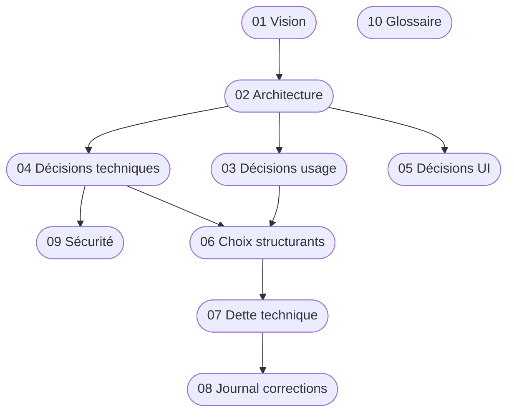

---
tags:
  - meshpay
  - meshpay
  - moc
Projets:
  - Mesh Pay
Topics:
  - Documentation technique
  - Monnaie locale
  - Paiement offline
Date: 2026-04-18
---

# MeshPay — Documentation technique (MOC)

> [!info] À quoi sert cette note
> Point d'entrée de toute la documentation technique du projet MeshPay. Chaque section ci-dessous renvoie vers une note dédiée.

MeshPay est un **système de paiement entièrement hors-ligne et décentralisé** qui tourne sur de petits boîtiers ESP32 à écran tactile, sans aucune infrastructure externe — pas de serveur, pas de cloud, pas d'internet. Les devices communiquent directement entre eux par ondes radio ([[ESP-NOW]] courte portée + [[LoRa]] longue portée) et partagent un registre [[DAG]] de transactions.

## 📜 Le pourquoi

- [[Misterniark/Projet/Mesh Pay/Doctech V2/Ancienne note technique/01 - Vision et esprit du projet]] — souveraineté monétaire, cas d'usage (festivals, villages, zones isolées, situations de crise), public cible

## 🏗 Comment ça marche

- [[Misterniark/Projet/Mesh Pay/Doctech V2/Ancienne note technique/02 - Architecture générale]] — vue d'ensemble des composants (crypto, DAG, wallet, comm, UI, HAL)
- [[Misterniark/Projet/Mesh Pay/Doctech V2/Ancienne note technique/10 - Glossaire et concepts]] — DAG, mesh, ESP-NOW, LoRa, Ed25519, fonte, checkpoint…

## ⚖️ Les choix qui ont été faits

- [[Misterniark/Projet/Mesh Pay/Doctech V2/Ancienne note technique/03 - Décisions d'usage]] — monnaie configurable, fonte/demurrage, multi-maîtres, solde initial
- [[Misterniark/Projet/Mesh Pay/Doctech V2/Ancienne note technique/04 - Décisions techniques]] — DAG vs blockchain, ESP-NOW vs Bluetooth, LoRa, CBOR, Ed25519, NVS chiffré…
- [[Misterniark/Projet/Mesh Pay/Doctech V2/Ancienne note technique/05 - Décisions UI]] — LVGL, 11 écrans, adaptation CYD / Waveshare, flows de paiement

## 🛡 Sécurité

- [[Misterniark/Projet/Mesh Pay/Doctech V2/Ancienne note technique/09 - Sécurité et durcissement]] — PIN PBKDF2, signatures Ed25519, attestations, rate-limiting, anti-rejeu…

## 🚧 Ce qui reste à faire

- [[Misterniark/Projet/Mesh Pay/Doctech V2/Ancienne note technique/06 - Choix structurants pour la suite]] — décisions qui auront un impact important sur les évolutions
- [[Misterniark/Projet/Mesh Pay/Doctech V2/Ancienne note technique/07 - Dette technique]] — limites connues, fixes reportés (notamment [[Misterniark/Projet/Mesh Pay/Doctech V2/Ancienne note technique/07 - Dette technique#Manifeste de monnaie signé C5|le manifeste de monnaie C5]])
- [[Misterniark/Projet/Mesh Pay/Doctech V2/Ancienne note technique/08 - Journal des corrections récentes]] — les 11 fixes issus de l'audit ChatGPT d'avril 2026
- [[Misterniark/Projet/Mesh Pay/Doctech V2/Ancienne note technique/12 - Refactoring main.c (Lot D)]] — decomposition de main.c (3521 lignes → modules), 8 lots
- [[Misterniark/Projet/Mesh Pay/Doctech V2/Ancienne note technique/13 - Gestion de l'énergie (design)]] — machine ACTIF/ÉCO sur ESP32-S3, HAL `hal_power`
- [[Misterniark/Projet/Mesh Pay/Doctech V2/Ancienne note technique/14 - Driver LoRa Core1262 (design)]] — remplacement du driver Wio-E5 par le Core1262 (SX1262 SPI)
- [[Misterniark/Projet/Mesh Pay/Doctech V2/Ancienne note technique/15 - Versioning et numéro de build]] — semver `VERSION` + compteur auto, affichage écran admin
- [[Misterniark/Projet/Mesh Pay/Doctech V2/Ancienne note technique/16 - DAG et sync LoRa v2 (design)]] — redesign de la source de verite DAG, persistance locale et protocole LoRa de rattrapage
- [[Misterniark/Projet/Mesh Pay/Doctech V2/Ancienne note technique/17 - Moniteur DAG LoRa e-paper]] — observateur passif DAG LoRa sur LILYGO H752 e-paper, UI terrain, GPIO et points de debug
- [[14 - Audit runtime Waveshare S3 Core1262]] — diagnostic runtime Waveshare S3 + Core1262, reboots, ecran noir, DAG post-init

## 🗂 Cartographie visuelle

## 🔗 Ressources hors-vault

- Code source : `/Users/misterniark/Code/TestClaude`
- Specs détaillées : `TestClaude/specs.md`
- Readme public : `TestClaude/MeshPay.md`
- Audit ChatGPT : `TestClaude/auditchatgtp.md`

## 🧭 Notes liées

- [[Mesh Pay (MOOC)]] — hub principal du projet
- [[Mesh Pay Expliqué]] — vulgarisation grand public
- [[Mesh Pay specs]] — spec technique 36 sections
- [[Mesh Coin]] — paramètres de monnaie
- [[auditchatgtp]] — audit code (C1-C6, I1-I7)
- [[auditusagechatgtp]] — audit UX (12 manques bloquants)
- Concepts : [[Mesh]], [[ESP-NOW]], [[LoRa]], [[DAG]]

## 📅 Historique du projet

- **Avril 2026** : audit complet de la fonte (demurrage), intégration complète, 10 tests ajoutés
- **15 avril 2026** : redirection des frais vers le mint_authority (au lieu d'être brûlés), audit des modules orphelins
- **17-18 avril 2026** : réception de [[Misterniark/Projet/Mesh Pay/Doctech V2/Ancienne note technique/08 - Journal des corrections récentes|l'audit ChatGPT]] et correction des 11 points critiques et importants
- **18 avril 2026** : création de cette documentation
- **17 mai 2026** : smoke test hardware Waveshare ESP32-S3 + Core1262 ; reboots/ecran noir corriges, dette debug DAG sans reset documentee
- **17 mai 2026** : decision de reprendre la DAG et la sync LoRa comme sous-systeme v2 avec persistance durable et protocole de rattrapage
- **19 mai 2026** : documentation du moniteur passif DAG LoRa e-paper sur LILYGO H752
