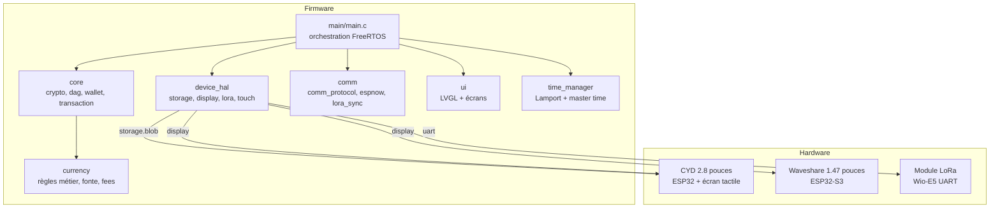
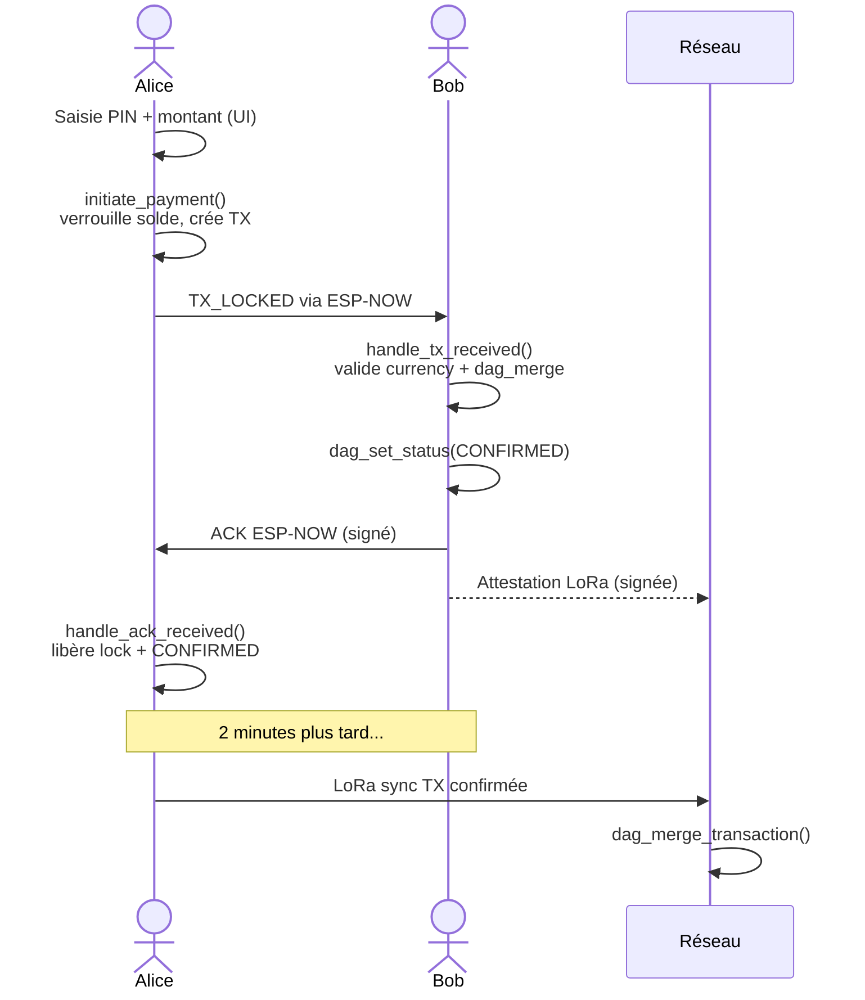

---
tags:
  - meshpay
  - meshpay
  - meshpay/architecture
  - tech/esp32
  - tech/freertos
Projets:
  - Mesh Pay
Topics:
  - Architecture logicielle
  - Embarqué
Date: 2026-05-11
---

# Architecture générale

> [!abstract] TL;DR
> MeshPay est un firmware ESP-IDF écrit en C, organisé en composants modulaires (`core`, `comm`, `device_hal`, `ui`, `currency`, `time_manager`). Trois tâches FreeRTOS se partagent le travail : ESP-NOW (prio 7), Core (prio 6), LoRa (prio 5). Un mutex unique protège l'état partagé.

## Vue d'ensemble

## Les composants (ESP-IDF)

| Composant | Rôle | Dépendances |
|---|---|---|
| `core/crypto` | Ed25519, SHA-256, génération/import keypair (via PSA Crypto) | mbedTLS |
| `core/transaction` | Création, validation, sérialisation CBOR des transactions | crypto, cbor |
| `core/dag` | Stockage de 250 TX max, insert, merge, prune, tips | transaction |
| `core/wallet` | Calcul de solde, locks, checkpoints | dag, transaction |
| `currency` | Règles monétaires (fonte, fees, plafond, expiration, mint_authorities) | crypto |
| `comm/comm_protocol` | Formats wire (ESP-NOW, LoRa), pack/unpack, events | crypto, transaction |
| `comm/espnow` | Discover, announce, tx locked, ack — communication courte portée | comm_protocol |
| `comm/lora_sync` | Sync TX, fragments, time sync, broadcast, ping/pong, attestation. **Décollé du DAG depuis le Lot C** : reçoit les TX à diffuser via callback. | comm_protocol, transaction, device_hal |
| `device_hal` | Abstractions storage (NVS), displays (CYD + Waveshare), LoRa | ESP-IDF drivers |
| `ui` | Écrans LVGL + logique PIN | LVGL |
| `time_manager` | Lamport timestamps + mode master time optionnel | — |

### Decomposition de `main/` (Lot D, depuis 2026-05-13)

`main/main.c` etait initialement un god object de 3521 lignes. Le refactor Lot D le decompose en modules locaux a `main/` :

| Module                       | Role                                                                  |
| ---------------------------- | --------------------------------------------------------------------- |
| `main/app_state.{h,c}`       | Storage de tout l'etat global (DAG, wallet, queues, HAL…)             |
| `main/time_glue.{h,c}`       | Wrappers temps + callback `main_collect_confirmed_txs` pour lora_sync |
| `main/stack_monitor.{h,c}`   | Tache `stkmon` de log periodique des HWM                              |
| `main/peers.{h,c}`           | Gestion de la table des peers ESP-NOW                                 |
| `main/currency_config_init.{h,c}` | Init hardcode TestCoin                                          |
| (a venir Lots 2-8)           | `persistence/`, `handlers/`, `ops/`, `transport/`, `core_task`, `app_init` |

Plan complet : [[Misterniark/Projet/Mesh Pay/Doctech V2/Ancienne note technique/12 - Refactoring main.c (Lot D)]].

## Les tâches FreeRTOS

| Tâche | Priorité | Stack (mots) | Rôle |
|---|---|---|---|
| `espnow_task` | 7 (haute) | 6144 | Réception/envoi ESP-NOW, callbacks radio Wi-Fi |
| `core_task` | 6 | 10240 | Boucle d'événements centrale, handlers, état partagé |
| `lora_task` | 5 | 6144 | Cycles LoRa sync périodiques (toutes les 2 min) |
| `ui_task` | 4 | 8192 | LVGL, écrans, événements UI |
| `stkmon` | 1 | 2048 | Log périodique des high-water-marks (debug) |

Les stacks ont été revues à la hausse au Lot C de l'audit Sonnet (mai 2026) — voir [[Misterniark/Projet/Mesh Pay/Doctech V2/Ancienne note technique/08 - Journal des corrections récentes#Item 8 stacks FreeRTOS sous dimensionnees instrumentation|le fix item 8]]. La tâche `stkmon` loggue toutes les 30 s la marge restante de chaque tâche critique via `uxTaskGetStackHighWaterMark` : permet de détecter les overflows en amont sans rebuilder un firmware instrumenté.

### Communication inter-tâches

- `evt_queue` : ESP-NOW/LoRa → `core_task` (événements entrants)
- `cmd_queue` : `core_task` → `espnow_task` (commandes sortantes)
- `s_state_mutex` : protège DAG + wallet + lock_table
- `s_ui_cmd_queue` : UI → core_task (commandes utilisateur)

> [!warning] Détail crucial — mutex non récursif
> `s_state_mutex` n'est **pas récursif**. Les fonctions appelées depuis `handle_ui_command()` (qui détient déjà le mutex) ne doivent PAS le reprendre — sinon deadlock. Voir [[Misterniark/Projet/Mesh Pay/Doctech V2/Ancienne note technique/08 - Journal des corrections récentes#C1 mutex UI core|le fix C1]].

> [!info] Découplage lora_sync (Lot C, mai 2026)
> Auparavant `main.c` passait `s_state_mutex` directement au composant `lora_sync` via `lora_cfg.dag_mutex` — inversion de dépendance : un composant comm tenait un verrou applicatif. Désormais `lora_sync` reçoit un **callback** `lora_collect_confirmed_txs_fn` que `main.c` implémente (`main_collect_confirmed_txs`). Le callback prend le mutex, copie les TX matching dans un buffer fourni, rend la main rapidement. Le composant `lora_sync` est ainsi découplé de la représentation interne du DAG et de la stratégie de verrouillage. Voir [[Misterniark/Projet/Mesh Pay/Doctech V2/Ancienne note technique/08 - Journal des corrections récentes#Item 7 decouplage du mutex applicatif partage avec lora sync|le fix item 7]].

## Les couches de communication

MeshPay utilise **deux radios complémentaires** :

### [[ESP-NOW]] (courte portée, rapide)

- Intégré aux ESP32, ne nécessite pas d'appairage Wi-Fi
- Latence 1-5 ms, portée ~200 m
- Utilisé pour : [[Misterniark/Projet/Mesh Pay/Doctech V2/Ancienne note technique/05 - Décisions UI#Flow de paiement|paiement instantané, ACK direct, découverte de pairs]]

### [[LoRa]] (longue portée, basse conso)

- Module externe (Wio-E5 en UART pour l'instant)
- Portée 2 km ou plus selon terrain, même à travers murs
- Débit faible (kilo-octets/s) mais fiable
- Utilisé pour : synchronisation globale du DAG, time sync, broadcasts maître, ping/pong, [[Misterniark/Projet/Mesh Pay/Doctech V2/Ancienne note technique/08 - Journal des corrections récentes#I2 attestation signée LoRa|attestations de confirmation]]

Voir détails et justifications dans [[Misterniark/Projet/Mesh Pay/Doctech V2/Ancienne note technique/04 - Décisions techniques#Communication radio hybride]].

## Le registre DAG

> [!info] Pas une blockchain
> MeshPay utilise un **[[DAG]]** (Directed Acyclic Graph, graphe acyclique orienté) plutôt qu'une blockchain. Chaque transaction peut avoir plusieurs parents, ce qui permet à plusieurs transactions de coexister en parallèle sans se bloquer mutuellement.

- **Fenêtre glissante** : 250 transactions max en RAM (~62 KB)
- **Checkpoints** : au seuil de 80% (200 TX), un snapshot des soldes est sauvé en Flash
- **Élagage** : après checkpoint, les TX consolidées sont purgées du DAG
- **Persistance** : checkpoints sauvegardés en NVS chiffré, callbacks injectables pour tests

Voir [[Misterniark/Projet/Mesh Pay/Doctech V2/Ancienne note technique/04 - Décisions techniques#Registre DAG]] et [[Misterniark/Projet/Mesh Pay/Doctech V2/Ancienne note technique/10 - Glossaire et concepts#DAG]].

## Les cibles hardware supportées

### CYD (Cheap Yellow Display) — ESP32 classique

- Écran tactile 2.8" (320×240), contrôleur ILI9341, touch XPT2046
- Wi-Fi + Bluetooth + GPIO libres pour LoRa UART
- **Mode complet** : paiement + admin + LoRa + ESP-NOW

### Waveshare ESP32-S3 1.47"

- Écran 172×320 JD9853 + touch AXS5106L
- PSRAM intégrée
- **Mode peer** : affichage + UI + ESP-NOW (paiement direct entre Waveshare validé en bench). Pas de LoRa onboard (Wio-E5 UART absent), donc pas de sync longue portée — le device dépend des CYD voisins pour la propagation réseau. Voir [[Misterniark/Projet/Mesh Pay/Doctech V2/Ancienne note technique/07 - Dette technique#🟢 ESP32-S3 sans LoRa]].

Voir [[Misterniark/Projet/Mesh Pay/Doctech V2/Ancienne note technique/05 - Décisions UI#Adaptation multi-écran]] pour l'adaptation d'interface.

## Flux type d'un paiement

## Ce qu'il faut retenir

- Firmware modulaire, pas de couplage entre `core` et les HAL
- État partagé unique (mutex) pour éviter les courses
- Double radio pour concilier rapidité (ESP-NOW) et portée (LoRa)
- Registre DAG compact avec checkpoints pour rester dans 520 KB de RAM
- Interface LVGL adaptée à deux écrans de tailles différentes

## Voir aussi

- [[Misterniark/Projet/Mesh Pay/Doctech V2/Ancienne note technique/04 - Décisions techniques]] — pourquoi ces choix
- [[Misterniark/Projet/Mesh Pay/Doctech V2/Ancienne note technique/09 - Sécurité et durcissement]] — couches de protection
- [[Misterniark/Projet/Mesh Pay/Doctech V2/Ancienne note technique/10 - Glossaire et concepts]] — lexique

## Notes liées

- [[Mesh Pay (MOOC)]] — hub du projet
- [[Mesh Pay specs]] — spec technique 36 sections
- [[Misterniark/Projet/Mesh Pay/Doctech V2/Ancienne note technique/00 - MeshPay (MOC)]] — index documentation technique
- Concepts : [[Mesh]], [[ESP-NOW]], [[LoRa]], [[DAG]]
