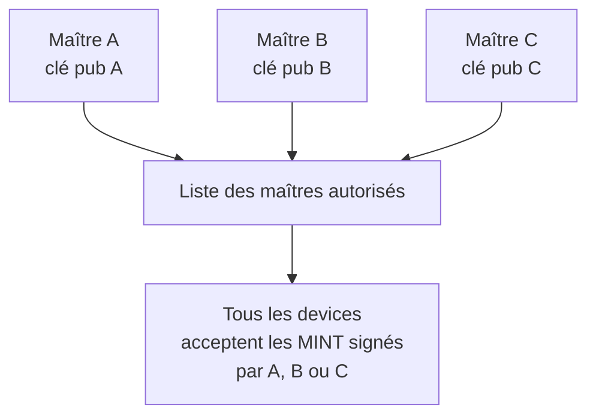

---
tags:
  - meshpay
  - meshpay
  - meshpay/décision
  - monnaie
  - fonte
Projets:
  - Mesh Pay
Topics:
  - Règles monétaires
  - Usage
Date: 2026-04-18
---

# Décisions d'usage

> [!abstract] De quoi parle cette note
> Les décisions qui touchent au **sens** de la monnaie et au comportement observable par l'utilisateur final. Pas de technique bas-niveau ici — voir [[Misterniark/Projet/Mesh Pay/Doctech V2/Ancienne note technique/04 - Décisions techniques]] pour ça.

## La monnaie est entièrement configurable

MeshPay ne créé pas "une" monnaie : il permet de **définir n'importe quelle monnaie locale** avec ses propres règles.

| Paramètre | Exemple | Obligatoire ? |
|---|---|---|
| Nom | "Festival2026" | ✅ |
| Symbole | "FC" | ✅ |
| Plafond (`max_supply`) | 100 000 | optionnel (0 = pas de plafond) |
| Réserve pré-minée | 100 000 | optionnel mais recommandé pour un événement |
| Solde initial (`initial_balance`) | 0 | historique / compatibilité |
| Frais de transfert (`transfer_fee`) | 1 FC par TX | optionnel |
| Fonte (`melt_*`) | 5% / mois | optionnel |
| Expiration (`valid_until`) | 31/12/2026 | optionnel |
| Décimales | 2 | optionnel |

Techniquement ces paramètres vivent dans la struct `currency_config_t` définie dans `components/currency/include/currency/currency_config.h`.

> [!warning] Limite actuelle
> La config monétaire est encore **hardcodée en C** dans `init_currency_config()`. Le self-master n'est plus le modèle produit : il devient un mode banc explicite (`MESHPAY_BENCH_SELF_MASTER`) pour tester avec les Waveshare sans CYD maître. Le vrai réseau partagé dépend toujours du [[Misterniark/Projet/Mesh Pay/Doctech V2/Ancienne note technique/07 - Dette technique#Manifeste de monnaie signé C5|manifeste signé C5]].

## Approvisionnement : réserve pré-minée

La décision produit est de privilégier une **réserve pré-minée** :

1. La masse initiale est créée au départ par une autorité connue.
2. Le device admin/distributeur possède cette réserve.
3. Les utilisateurs reçoivent des crédits par `TRANSFER` depuis la réserve.
4. Le `MINT` à chaud reste réservé à une procédure exceptionnelle ou au banc de test.

Ce modèle est plus simple à expliquer hors ligne : on ne "fabrique" pas de monnaie pendant chaque vente, on distribue une réserve déjà créée.

### Banc Waveshare : initialisation depuis l'UI

Tant que le manifeste signé n'existe pas, le banc Waveshare dispose d'un écran `Admin > Init monnaie`.

Cet écran :

1. demande un montant de réserve ;
2. écrit ce montant en NVS (`test_res_amt`) ;
3. crée une TX `MINT` locale une seule fois ;
4. marque la réserve comme appliquée (`test_res_done`) ;
5. conserve la TX (`test_res_tx`) pour la rediffuser aux peers après reboot.

Ce flux est volontairement limité au banc. Il ne remplace pas le lancement produit d'une monnaie.

## La fonte (demurrage)

C'est un concept monétaire peu courant mais **central à l'esprit** de MeshPay.

### Principe

Les soldes **diminuent légèrement avec le temps**. Exemple avec fonte de 5% / mois :

| Temps | Solde de 1000 |
|---|---|
| T+0 | 1000 |
| T+1 mois | 950 |
| T+2 mois | 902 |
| T+3 mois | 857 |

### Pourquoi

> [!quote] La monnaie fondante (Silvio Gesell)
> La monnaie ne doit pas être un objet d'accumulation mais un outil de circulation. Si elle perd lentement de la valeur à l'accumulation, elle incite à dépenser, donc à faire tourner l'économie locale.

Pour une monnaie communautaire, thésauriser n'a **aucun intérêt collectif**. La fonte garantit que la monnaie reste dynamique et ne se concentre pas sur quelques comptes.

### Deux modes implémentés

| Mode | Formule | Cas d'usage |
|---|---|---|
| `MELT_MODE_BPS` | Pourcentage composé (ex: 100 bps = 1% par tick) | Fonte proportionnelle standard |
| `MELT_MODE_FIXED` | Montant fixe soustrait par tick | Démurrage linéaire, simple à expliquer |

Un "tick" est configurable via `melt_period_seconds` (par défaut 86400 s = 1 jour).

### Quand elle s'applique

- **Au checkpoint automatique** (par le maître time) : tous les comptes du checkpoint sont fondus simultanément selon les ticks écoulés
- **À la lecture** dans l'UI : la fonte est appliquée en lecture seule pour l'affichage (pas de mutation de l'état)

Voir détails techniques dans [[Misterniark/Projet/Mesh Pay/Doctech V2/Ancienne note technique/04 - Décisions techniques#Fonte globale au checkpoint]] et le code `currency_melt_*`.

## Multi-maîtres / distributeurs indépendants

**Plusieurs appareils peuvent être autorisés à gérer une réserve ou à signer des opérations de création contrôlées**. Chaque maître/distributeur a sa propre clé publique, toutes inscrites dans `mint_authorities[]` (jusqu'à 8).

En mode produit, ils doivent surtout **distribuer** depuis des réserves connues. La création indépendante de monnaie reste possible techniquement, mais elle demande une politique de plafond/réconciliation.

> [!todo] Réconciliation en cas de dépassement
> Deux maîtres peuvent techniquement émettre en parallèle et dépasser `max_supply` collectivement. Un mécanisme de réconciliation reste à définir — voir [[Misterniark/Projet/Mesh Pay/Doctech V2/Ancienne note technique/07 - Dette technique#Réconciliation multi-maîtres]].

## Les frais de transfert

Chaque transfert peut porter une commission (`transfer_fee`). Elle est **stockée dans la transaction** au moment de la création — donc elle reste cohérente même si le taux de frais change plus tard.

### Décision récente : redirection plutôt que burn

> [!success] Décision validée le 15 avril 2026
> Les frais sont désormais **redirigés vers le premier `mint_authority`** (l'organisateur du réseau) plutôt qu'être brûlés (retirés de la masse monétaire).

Raison : dans un festival ou un marché, l'organisateur supporte les coûts (boîtiers, maintenance, communication). Les frais de transaction lui reviennent comme rémunération de ce travail. C'est plus cohérent économiquement qu'un burn qui n'alimente personne.

Si `fee_recipient` n'est pas configuré (tout-zéro), les fees sont **brûlés** (ancien comportement par défaut).

Voir [[Misterniark/Projet/Mesh Pay/Doctech V2/Ancienne note technique/08 - Journal des corrections récentes#C6 fee recipient avant currency]] pour l'historique du fix.

## Le solde initial au premier boot

Ce chemin est maintenant historique. Le modèle produit n'utilise plus `initial_balance` pour créditer automatiquement chaque device. Pour les tests Waveshare, on utilise plutôt `MESHPAY_TEST_DEVICE_SEED`, qui crée un seed idempotent par campagne.

Ancien comportement : au premier démarrage d'un device (détecté par l'absence de checkpoint NVS), si `initial_balance > 0` :

1. Une transaction MINT est créée, émise par le device vers lui-même
2. Cette TX est insérée dans le DAG, auto-confirmée (pas d'ACK requis)
3. Le solde affiché vient ensuite du DAG (pas d'un `base_balance` passé à l'UI)

> [!danger] Bug historique important
> Avant le fix C3, l'UI passait aussi `initial_balance` comme base — ce qui faisait afficher **2× `initial_balance`** au boot. Corrigé le 18 avril 2026. Voir [[Misterniark/Projet/Mesh Pay/Doctech V2/Ancienne note technique/08 - Journal des corrections récentes#C3 double comptage initial balance]].

## Unité monétaire : une abstraction

Le code ne manipule que des "crédits" bruts (`uint32_t`). L'affichage utilisateur applique :
- Le **symbole** (`symbol`, ex: "FC")
- Les **décimales** (`decimals`, ex: 2 → 100 crédits = "1,00 FC")

Il n'y a aucune référence à une devise réelle (euro, dollar…). Le réseau décide de la valeur d'échange qu'il donne à ses crédits.

## Résumé des décisions d'usage

| Décision | Choix | Pourquoi |
|---|---|---|
| Monnaie configurable | Tous les paramètres personnalisables | Adaptation aux besoins locaux |
| Fonte / demurrage | Supportée (BPS ou fixe) | Encourager la circulation, éviter l'accumulation |
| Réserve pré-minée | Modèle produit recommandé | Simple, offline, moins inflationniste |
| Mode Waveshare self-master | Conservé pour banc de test | Tester sans CYD maître |
| Multi-maîtres | Jusqu'à 8 clés autorisées | Résilience + distribution décentralisée |
| Frais de transfert | Redirigés au 1er mint_authority | Rémunère l'organisateur du réseau |
| Solde initial | Historique, remplacé par seed test ou réserve | Évite la création implicite sur chaque device |
| Unité | Abstraite ("crédits") | Pas de dépendance aux monnaies nationales |

## Voir aussi

- [[Misterniark/Projet/Mesh Pay/Doctech V2/Ancienne note technique/01 - Vision et esprit du projet]] — pourquoi ces choix ont du sens
- [[Misterniark/Projet/Mesh Pay/Doctech V2/Ancienne note technique/04 - Décisions techniques]] — comment c'est implémenté
- [[Misterniark/Projet/Mesh Pay/Doctech V2/Ancienne note technique/07 - Dette technique]] — ce qui reste à améliorer
- [[Misterniark/Projet/Mesh Pay/Doctech V2/Ancienne note technique/10 - Glossaire et concepts]] — lexique

## Notes liées

- [[Mesh Pay (MOOC)]] — hub du projet
- [[Mesh Coin]] — paramètres de monnaie
- [[auditusagechatgtp]] — audit UX (12 manques bloquants)
- [[Misterniark/Projet/Mesh Pay/Doctech V2/Ancienne note technique/00 - MeshPay (MOC)]] — index documentation technique
