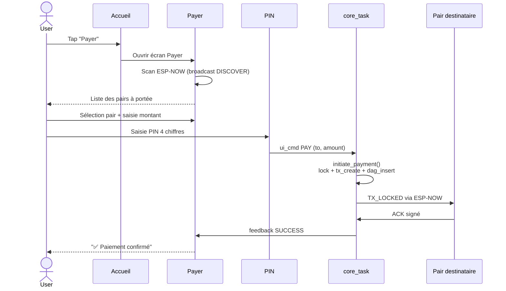

---
tags:
  - meshpay
  - meshpay
  - meshpay/ui
  - meshpay/décision
  - tech/lvgl
Projets:
  - Mesh Pay
Topics:
  - Interface utilisateur
  - UX
Date: 2026-04-18
---

# Décisions UI

> [!abstract] Objectif
> Documenter les choix d'interface utilisateur et le raisonnement derrière. Pour les détails techniques bas niveau, voir [[Misterniark/Projet/Mesh Pay/Doctech V2/Ancienne note technique/04 - Décisions techniques]]. Pour le code : `components/ui/`.

## Choix de la lib graphique : LVGL 9.2

**LVGL** (Light and Versatile Graphics Library) est la référence embarquée depuis plusieurs années. Choisie pour :

- Support natif ESP-IDF (composant managed)
- Performances acceptables sur ESP32 (même sans PSRAM)
- Widgets modernes (touch, animations, styles)
- Licence MIT (compatible projet ouvert)
- Communauté active

Alternatives écartées :
- **µGUI** : trop limitée, pas de touch native
- **TFT_eSPI** : niveau bas, pas de widgets
- **Écriture custom** : réinventerait la roue

## Deux hardwares, une seule UI

| Hardware                                                                     | Écran                 | Rôle                                             |
| ---------------------------------------------------------------------------- | --------------------- | ------------------------------------------------ |
| [[Misterniark/Projet/Mesh Pay/Doctech V2/Ancienne note technique/02 - Architecture générale#CYD Cheap Yellow Display ESP32 classique\|CYD]] | 2.8" tactile, 320×240 | Mode complet (paiement + admin + LoRa + ESP-NOW) |
| [[Misterniark/Projet/Mesh Pay/Doctech V2/Ancienne note technique/02 - Architecture générale#Waveshare ESP32-S3 1 47\|Waveshare ESP32-S3]]   | 1.47", 172×320        | Mode client simplifié, format poignet            |

### Adaptation multi-écran

L'UI détecte la résolution au boot et s'adapte :

- **Grand écran (CYD)** : pavé numérique complet, menus latéraux, icônes
- **Petit écran (Waveshare)** : navigation simplifiée, tailles optimisées, texte plus grand

Le contexte UI (`ui_ctx_t`) contient `screen_w`, `screen_h` et un flag `is_small_screen` (vrai si w < 200 px).

## Les écrans (11 modules)

Chaque écran est un module autonome dans `components/ui/src/ui_screen_*.c`. Enregistrement via table `s_screens[]` avec callbacks `create` + `update`.

| # | Écran | Rôle | Accès |
|---|---|---|---|
| 1 | **Setup** | Premier boot : création PIN, alias | Auto au premier démarrage |
| 2 | **PIN** | Déblocage du device | Boot suivants |
| 3 | **Accueil** | Solde, alias, boutons principaux | Écran d'accueil |
| 4 | **Payer** | Scan de peers, saisie montant, PIN de confirmation | Depuis accueil |
| 5 | **Recevoir** | Affichage pubkey + alias, attente TX | Depuis accueil |
| 6 | **Historique** | Liste des TX récentes | Depuis accueil |
| 7 | **Paramètres** | Alias, fonte, beneficiary | Depuis accueil |
| 8 | **Admin** (maître uniquement) | Accès MINT, broadcast, scan, rename | Depuis paramètres si `is_master` |
| 9 | **MINT** | Création de crédits (maître) | Admin |
| 10 | **Broadcast** | Saisie texte 157 chars, signé et diffusé | Admin |
| 11 | **Scan réseau** | Ping LoRa, liste des pongs reçus | Admin |

## Flow de paiement (user journey)

## Principe du PIN

- **4 chiffres** (trade-off entre ergonomie et sécurité)
- **Jamais stocké en clair** : `PBKDF2-HMAC-SHA256` avec sel, 10 000 itérations
- **Blacklist** de PIN trop faibles (0000, 1234, 1111, etc.)
- **Anti brute-force progressif** :
  - 3 échecs → attente 30 s
  - 5 échecs → attente 5 min
  - 10 échecs → device **bloqué définitivement**

Implémentation : `components/ui/src/ui_pin.c` + persistance NVS chiffrée.

> [!warning] Compromis conscient
> Un PIN 4 chiffres est faible cryptographiquement (10 000 combinaisons). La protection vient du **blocage progressif + définitif** et du chiffrement NVS du hash. Il faut physiquement voler ET le device ET le PIN pour compromettre un compte.

## Feedback paiement core → UI

Une variable `volatile ui_pay_feedback_t s_pay_feedback` est écrite par `core_task` et lue par l'UI pour savoir si le paiement a réussi / échoué / timeout. Simple et lock-free.

Valeurs possibles :
- `UI_PAY_FEEDBACK_NONE`
- `UI_PAY_FEEDBACK_PENDING`
- `UI_PAY_FEEDBACK_SUCCESS`
- `UI_PAY_FEEDBACK_TIMEOUT`
- `UI_PAY_FEEDBACK_INSUFFICIENT`
- etc.

## Format de l'alias

Chaque device a un **alias lisible humain** en plus de sa clé publique.

- Généré automatiquement au premier boot : `<Adjectif>-<Animal>` (ex: "Brave-Loup", "Vif-Renard")
- 16 adjectifs × 16 animaux = 256 combinaisons (entropie ~8 bits, suffisant pour du local)
- Modifiable à distance par le maître via `COMM_MSG_LORA_SET_ALIAS`
- Modifiable localement dans Paramètres

## Choix conscient : UI transparente sur la crypto

> [!tip] Principe de design UX
> L'utilisateur final **ne voit jamais** de clés publiques, de hashs, de signatures. Il voit un alias, un montant, une action. La crypto est un moyen, pas une fin.

Exemples :
- "Payer à **Brave-Loup** : 50 FC" (pas "payer à `0x3f2a8e...`")
- "Code PIN" (pas "clé privée chiffrée")
- "Scan réseau" (pas "broadcast ping LoRa signé Ed25519")

## Ce qui manque dans l'UI (à faire)

- [ ] Écran "setup réseau" (créer / rejoindre) — dépend de [[Misterniark/Projet/Mesh Pay/Doctech V2/Ancienne note technique/07 - Dette technique#Manifeste de monnaie signé C5]]
- [ ] Affichage du manifeste de monnaie signé (qui est organisateur ? quelles règles ?)
- [ ] Gestion d'un QR code pour la root key de fondation
- [ ] UI de consommation d'un broadcast reçu (réveil écran + popup) — actuellement juste un flag `s_broadcast_pending` sans consommateur
- [ ] Écran d'historique enrichi avec filtrage par date / type / pair

## Voir aussi

- [[Misterniark/Projet/Mesh Pay/Doctech V2/Ancienne note technique/02 - Architecture générale]] — comment l'UI s'intègre dans le firmware
- [[Misterniark/Projet/Mesh Pay/Doctech V2/Ancienne note technique/09 - Sécurité et durcissement#PIN]]
- [[Misterniark/Projet/Mesh Pay/Doctech V2/Ancienne note technique/07 - Dette technique]]

## Notes liées

- [[Mesh Pay (MOOC)]] — hub du projet
- [[auditusagechatgtp]] — audit UX (12 manques bloquants UI)
- [[Misterniark/Projet/Mesh Pay/Doctech V2/Ancienne note technique/00 - MeshPay (MOC)]] — index documentation technique
- Concepts radio cités : [[ESP-NOW]], [[LoRa]]
