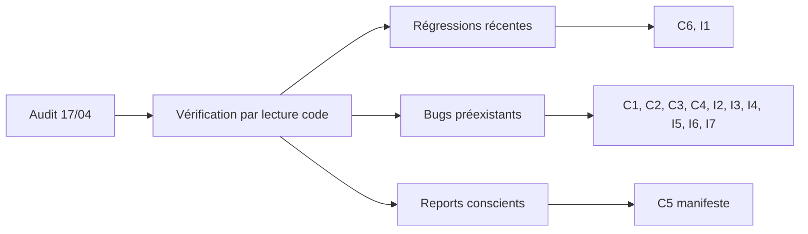

---
tags:
  - meshpay
  - meshpay
  - meshpay/journal
  - audit
  - sécurité
Projets:
  - Mesh Pay
Topics:
  - Corrections
  - Audit
Date: 2026-05-14
---

# Journal des corrections récentes

> [!abstract] Contexte
> Deux passes d'audit successives :
> - **Avril 2026** : audit ChatGPT — 6 risques critiques (C1-C6) + 7 importants (I1-I7), 11 corrigés + 1 reporté ([[#C5 reporté|C5]]).
> - **Mai 2026** : audit Claude Sonnet — 16 points classés CRITIQUE / HAUTE / MOYENNE / OBSERVATIONS. Lots A, B, C executes ; lots 1 (cle Secure Boot Dropbox), 5 (Flash Encryption mode RELEASE) et D (refactor `main.c`) reportes consciemment.

---

# Smoke test hardware Waveshare S3 + Core1262 — 2026-05-17

> [!info] Resume
> Deux Waveshare ESP32-S3 1.47 Touch Display + Core1262 SX1262 redemarraient regulierement puis affichaient un ecran noir apres les premiers essais. Les deux eFuses flash encryption etant brules, les cartes ont ete flashees en `encrypted-flash`. Diagnostic complet dans [[14 - Audit runtime Waveshare S3 Core1262]].

## Corrections appliquees

### Stack FreeRTOS et buffers LoRa

**Probleme** : les tailles de stack etaient commentees/raisonnees comme des mots alors que ESP-IDF attend des octets. En plus, `lora_sync_send_one_tx()` gardait les buffers de fragmentation LoRa sur la pile.

**Correction** : stacks explicites dans `main/app_state.h`, checks de creation de taches dans `main/main.c`, et buffers de fragmentation deplaces en statique dans `components/comm/lora_sync/src/lora_sync.c`.

### Driver SX1262 / Core1262

**Probleme** : avec `SPI_DMA_DISABLED`, les transferts polling longs vers le SX1262 depassaient la limite du host SPI sur les payloads LoRa de 227/255 octets.

**Correction** : ecriture/lecture SPI chunked en 64 octets dans `components/device_hal/src/esp32/sx126x_hal.c`, NSS maintenu bas pendant l'operation logique. Stack RX Core1262 augmentee a 8 Ko dans `components/device_hal/src/esp32/hal_lora_core1262.c`.

### Ecran noir LVGL

**Probleme** : l'augmentation des stacks a revele une pression RAM cote affichage ; l'allocation LVGL etait trop large.

**Correction** : buffer LVGL reduit a un buffer DMA partiel de 8 lignes (~5120 octets) dans `components/ui/src/ui_task.c`.

### Verification DAG

**Correction partielle** : ajout d'un check `dag_integrity_log("post_init")` dans `main/main.c`. Les deux devices ont loggue un DAG post-init coherent (`count=1`, `tips=1`, `confirmed=1`).

**Dette** : apres deux transactions utilisateur, l'ouverture brute du port serie pour verifier le DAG a encore declenche `USB_UART_CHIP_RESET`. Les transactions RAM ont donc ete perdues par reboot avant verification. Il faut un canal de debug non-reset ou un audit DAG declenche automatiquement par firmware.

## Verification hardware

- `/dev/cu.usbmodem101` : MAC `44:1b:f6:86:13:c8`, alias `Brave-Cigale`, UI OK, LoRa `len=227` resultat `0`.
- `/dev/cu.usbmodem2101` : MAC `44:1b:f6:86:11:e4`, alias `Brave-Merle`, UI OK, LoRa `len=228`, puis fragments `255 + 11 + 226`, resultats `0`.
- ESP-NOW : decouverte de peers et echanges `TX_LOCKED` / `ACK` observes.
- Build : `ninja -C build` OK.

**Conclusion** : pas de preuve d'un Core1262 defectueux. Le probleme venait principalement du code runtime et de la pression ressources ; le driver SX1262 avait bien besoin du chunking SPI pour les transferts longs.

# Audit Sonnet — Lots A / B / C (mai 2026)

> [!info] Resume
> Trois lots executes en sequence, chacun valide par `idf.py build` final OK.
> Lots reportes : 1, 5, 6 (refactor `main.c` 3000+ lignes = session dediee).
> Builds finaux : ESP32 `0x126990` (~1.17 Mo, 34% libre dans la partition app).

## Lot A — Correctifs UI cibles

### B1 — Pile de navigation saturee perd silencieusement le chemin de retour

**Probleme** : `ui_manager_show()` empilait `s_current` uniquement si `s_nav_top < UI_NAV_STACK_DEPTH - 1`. Si la pile etait pleine, la navigation continuait quand meme — l'ecran courant etait detruit, le nouveau cree, mais le chemin de retour cassait silencieusement (un `back()` ulterieur ramenait au mauvais ecran).

**Correction** : refus complet de la navigation si la pile est saturee. Test `s_nav_top >= UI_NAV_STACK_DEPTH - 1` **avant** de detruire l'ecran courant. Retourne `false`. Signature de `ui_manager_show` et `ui_manager_back` passees a `bool` (les 24 callsites ignorent deja le retour : non-breaking).

**Fichiers** : `components/ui/src/ui_manager.c`, `components/ui/include/ui/ui_manager.h`

### B2 — `ui_manager_back()` plantait sur deref NULL

**Probleme** : `s_handlers[prev]->create(s_ctx)` ne verifiait pas que le handler etait non-NULL. Une table de handlers incomplete (ex: enum etendu) plantait sur deref.

**Correction** : guard `s_handlers[prev] && s_handlers[prev]->create`, fallback sur `UI_SCREEN_HOME`, et si HOME lui-meme est absent retour de `false` sans modifier l'etat.

**Fichiers** : `components/ui/src/ui_manager.c`

### B4 — Cooldown PIN bloque indefiniment apres reboot

**Probleme** : `esp_timer_get_time()` repart a zero apres un reboot, alors que `last_fail` est persiste en NVS et peut provenir d'une session anterieure ou la valeur etait beaucoup plus elevee. Resultat : `now - last_fail` negatif, `elapsed_s < required_delay` toujours vrai, cooldown infini — l'utilisateur ne peut plus deverrouiller.

**Correction** : guard `if (now < last_fail)` dans `ui_pin_verify` et `ui_pin_cooldown_remaining` ; le cooldown est traite comme expire dans ce cas. Pas de reecriture NVS dans le chemin lecture (le prochain echec ecrira un timestamp frais).

**Fichiers** : `components/ui/src/ui_pin.c`

### Tests ajoutes (Lot A)

- `test_ui_manager.c` (nouveau) : 6 cas (init, push, back vide, aller-retour, B1 saturation, B2 fallback). Inclut stubs LVGL + handlers fictifs pour pouvoir tester sans linker les vrais ecrans.
- `test_ui_pin.c` : 2 cas supplementaires (`pin_cooldown_stale_timestamp_after_reboot`, `pin_cooldown_remaining_stale_timestamp`).

### Ajout API : `ui_manager_nav_depth()`

Accesseur public sur la profondeur de la pile de navigation. Utile pour introspection (breadcrumb UI, debug) et pour les tests.

---

## Lot B — Securite couche transport

### Item 2 — Anti-rejeu nonce ESP-NOW

**Probleme** : `nonce_cache` etait dimensionne a 32 entrees (~0.6 s de memoire au rate-limit max), avec deux defauts :
1. Initialisation `memset` a zero faisait que `nonce_cache_seen(0)` retournait toujours `true` — le nonce 0 etait systematiquement rejete des l'init.
2. Apres 32 echanges, l'entree la plus ancienne etait ecrasee FIFO — un attaquant pouvait rejouer un vieux nonce dans une fenetre courte.

**Correction (mitigation 32 bits, pas de rupture wire)** :
- Cache passe a **48 entrees** (couvre ~1 s a 50 msg/s rate-limit). Plafond contraint par la marge DRAM : une cible plus large (128) faisait deborder `dram0_seg`.
- Ajout d'un compteur `filled` separe : `seen()` ne scanne que les entrees valides. Le nonce 0 est desormais traite comme n'importe quelle autre valeur.
- Commentaires rectifies : eviction est FIFO, pas LRU (le module est `nonce_cache`, pas "LRU").

**Tests** : `test_nonce_cache.c` reecrit. Retire la "limitation acceptee" sur nonce=0, ajoute `nonce_cache_zero_traite_comme_normal`, `nonce_cache_filled_sature`, et ajuste `wrap_around` / `wrap_complet` pour la nouvelle taille.

**Fichiers** : `components/comm/espnow/include/comm/nonce_cache.h`, `components/comm/espnow/src/nonce_cache.c`, `components/comm/espnow/test/test_nonce_cache.c`

### Item 3 — ACK destinataire verifie dans la couche comm

**Probleme** : la verification que `ack.sender_key == tx.to` etait deleguee a `core_task` (commentaire `[C4-fix]` dans `espnow.c`). Si `core_task` l'omettait ou echouait silencieusement, un tiers connaissant un `tx_id` en circulation pouvait signer son propre ACK et faire confirmer le paiement vers une fausse cible.

**Correction (defense en profondeur)** : table `s_pending_tx_table` interne a `espnow.c`. A chaque `COMM_CMD_SEND_TX`, on enregistre `(tx_id, expected_signer = tx.to, deadline)`. A reception d'un `COMM_MSG_TX_ACK`, on verifie **dans la couche comm** que le `tx_id` est attendu ET que `ack.sender_key == expected_signer`, **avant** `xQueueSend`. core_task continue sa propre verif via `lock_table` (non remplacee, complement).

**Trade-off RAM** : taille initialement prevue 8 entrees, reduite a **1** pour rester dans la marge DRAM. Couvre le cas standard "un paiement actif a la fois". Si auto-forward arrive pendant un paiement manuel, le 1er est ecrase silencieusement — l'utilisateur le voit en timeout UI au bout de 30 s.

**Fichiers** : `components/comm/espnow/src/espnow.c`

### Item 4 — Verification de signature des messages LoRa avant queue

**Probleme** : `LORA_TX`, `LORA_FRAG` (apres reassemblage), `LORA_BROADCAST`, `LORA_SET_ALIAS`, `LORA_SET_BENEFICIARY` etaient desserialises et postes directement dans `evt_queue` **sans verification de signature**. La signature etait verifiee uniquement si `core_task` appelait sa fonction de validation. Symetrie cassee par rapport a `LORA_TIME_SYNC`, `LORA_PING`, `LORA_PONG`, `LORA_ATTESTATION` qui etaient deja verifies en couche LoRa.

**Correction** :
- Trois nouvelles fonctions publiques dans `comm_protocol` (symetrie des `pack_*`) :
  - `comm_msg_verify_broadcast(msg)` — verifie `[text_len:1][text:N]` avec `sender_key`
  - `comm_msg_verify_set_alias(msg)` — verifie `[target_key:32][alias_len:1][alias:N]` avec `master_key`
  - `comm_msg_verify_set_beneficiary(msg)` — verifie `[target_key:32][beneficiary_key:32][interval:2 BE]` avec `master_key`
- `lora_sync.c` appelle ces fonctions ainsi que `tx_validate_signature()` pour `LORA_TX` et fragments reassembles **avant** `xQueueSend`.

**Defense en profondeur** : core_task continue de verifier l'identite "maitre autorise" (presence dans `mint_authorities`) et la cible (`target_key == ma cle`). La couche comm ne fait que la verif crypto pure ; l'autorisation reste applicative.

**Fichiers** : `components/comm/comm_protocol/include/comm/comm_msg.h`, `components/comm/comm_protocol/src/comm_msg.c`, `components/comm/lora_sync/src/lora_sync.c`

---

## Lot C — Taches & couplage

### Item 8 — Stacks FreeRTOS sous-dimensionnees + instrumentation

**Probleme** : `ESPNOW_TASK_STACK = 4096` et `LORA_TASK_STACK = 4096` (en mots, soit 16 Ko) etaient justes pour des taches qui font de la crypto Ed25519/SHA-256 + serialisation CBOR sur des buffers de plusieurs centaines d'octets. Stack overflow silencieux corrompt le heap.

**Correction** :
- `ESPNOW_TASK_STACK` : 4096 → **6144**
- `LORA_TASK_STACK` : 4096 → **6144**
- `CORE_TASK_STACK` : 8192 → **10240** (agrege tout le traitement metier + DAG)
- Ajout d'une tache `stkmon` de priorite 1 qui loggue toutes les 30 s les high-water-marks (`uxTaskGetStackHighWaterMark`) des taches critiques. Permet d'ajuster les tailles en production sans reflasher un build instrumente.

**Fichiers** : `main/main.c`

### Item 7 — Decouplage du mutex applicatif partage avec `lora_sync`

**Probleme** : `main.c` passait `s_state_mutex` au composant `lora_sync` via `lora_cfg.dag_mutex`. Le composant prenait ce mutex pour scanner le DAG. Inversion de dependance : un composant comm prenait un verrou applicatif. Si `core_task` tenait le mutex pendant une operation longue, `lora_sync_task` bloquait 1 s avant abandon et pouvait rater une fenetre radio.

**Correction** :
- Suppression des champs `dag_t *dag` et `SemaphoreHandle_t dag_mutex` dans `lora_sync_config_t`.
- Ajout d'un callback `lora_collect_confirmed_txs_fn` que `main.c` fournit (`main_collect_confirmed_txs`). Le callback prend le mutex applicatif, copie les TX matching dans un buffer fourni, rend la main rapidement.
- `lora_sync.h` retire les includes `dag/dag.h` et `freertos/semphr.h`. CMakeLists.txt retire `dag` de `REQUIRES`.
- Le composant `lora_sync` est desormais decouple de la representation interne du DAG et de la strategie de verrouillage applicative.

**Fichiers** : `components/comm/lora_sync/include/comm/lora_sync.h`, `components/comm/lora_sync/src/lora_sync.c`, `components/comm/lora_sync/CMakeLists.txt`, `main/main.c`

---

## Reports conscients (audit Sonnet)

> [!warning] Items NON traites dans cette session
> - **Item 1 (CRITIQUE)** — Cle de signature Secure Boot dans Dropbox. Decision utilisateur : ne pas corriger pour l'instant. **Risque assume** : qui acces au Dropbox peut signer un firmware accepte par tous les appareils flashes avec cette cle. A regler avant tout deploiement production.
> - **Item 5 (HAUTE)** — `CONFIG_SECURE_FLASH_ENCRYPTION_MODE_DEVELOPMENT` actif. Decision utilisateur : reporte. UART/JTAG restent ouverts en presence physique. A basculer en mode RELEASE avant production.
> - **Item 6 (HAUTE)** — Refactor `main.c` (3000+ lignes, god object). Reporte en **Lot D** (session dediee — refactor cassant qu'on ne peut pas melanger avec les correctifs de securite). Extraction prevue en 3 composants : `payment_engine`, `app_storage`, `mesh_protocol`.

## Trade-offs RAM imposes par la marge DRAM

> [!info] Marge DRAM serree
> Le binaire pre-Lot-B etait deja a la limite. Les ajouts BSS du Lot B ont fait deborder `dram0_seg` une premiere fois (+760 octets), puis une seconde (+72 octets). Plusieurs constantes ont du etre reduites :
>
> | Constante | Audit | Plan initial | Final | Pourquoi |
> |---|---|---|---|---|
> | `NONCE_CACHE_SIZE` | 16 | 128 | **48** | DRAM saturee, marge x1.5 vs original au lieu de x4 |
> | `PENDING_TX_TABLE_SIZE` | n/a | 8 | **1** | DRAM saturee, 1 paiement actif a la fois |
>
> Pour remonter ces valeurs il faudra liberer de la RAM ailleurs (sdkconfig, buffers lvgl, ou autre).

---

## Builds finaux apres audits

| Cible | Pre-audits | Post audit avril | Post audit Sonnet (mai) |
|---|---|---|---|
| ESP32 (CYD) | n/a | `0x125f10` (~1.16 Mo, 34% libre) | `0x126990` (~1.17 Mo, 34% libre) |
| ESP32-S3 (Waveshare) | n/a | `0xb45e0` (~720 Ko, 60% libre) | non rebuild (pas de changement target-specific) |

# Audit ChatGPT — C1-C6 / I1-I7 (avril 2026)

## Vue d'ensemble



## Les 11 fixes appliqués

### C1 — Mutex UI/core (deadlock systématique sur paiement)

**Problème** : `s_state_mutex` est créé avec `xSemaphoreCreateMutex()` (non récursif). `core_task` prend le mutex, puis appelle `handle_ui_command()` qui appelle `initiate_payment()` qui tente de reprendre le même mutex → deadlock/timeout systématique.

**Correction** : `initiate_payment()` et `initiate_mint()` passées en static (appelants uniquement `handle_ui_command` qui détient déjà le mutex). Prise/libération du mutex retirées des fonctions. Commentaire explicite `[C1-fix]` dans le code.

**Fichiers** : `main/main.c`

---

### C2 — Validation du solde émetteur

**Problème** : `handle_tx_received()` calculait `sender_balance` via `wallet_get_balance(&s_wallet, 0, ...)` — donc avec le wallet local du device, pas avec celui de `rx_tx->from`. Le récepteur validait selon **son propre solde**, pas celui de l'émetteur.

**Correction** : Ajout de `wallet_get_balance_for(dag, checkpoint, pubkey, fee_recipient, *balance)` qui calcule le solde de n'importe quelle pubkey (checkpoint + DAG post-checkpoint). Utilisé dans `handle_tx_received`.

> [!warning] Limite assumée
> Le récepteur n'a pas forcément tout le DAG du `from`. Donc c'est une défense en profondeur, pas une garantie forte. Les vraies garanties restent le **lock source** (côté émetteur) et le **nonce monotone** (I3).

**Fichiers** : `wallet.h`, `wallet.c`, `main.c`

---

### C3 — Double comptage initial_balance

**Problème** : au premier boot, une TX MINT pour `initial_balance` est créée dans le DAG. Mais l'UI passait **aussi** `initial_balance` comme `base_balance` à `wallet_get_balance()` → le solde affiché = 2 × `initial_balance`.

**Correction** : Ajout d'un callback `get_owner_balance` dans `ui_ctx_t`. L'UI l'utilise au lieu de passer `initial_balance` directement. La helper `compute_owner_balance()` dans main.c utilise checkpoint + DAG (voir aussi [[#I1 checkpoints comme base runtime|I1]]).

**Fichiers** : `ui_state.h`, `ui_screen_home.c`, `main.c`

---

### C4 — ACK non lié au destinataire

**Problème** : `handle_ack_received()` confirmait le lock sur la seule base du `tx_id`. Il ne vérifiait PAS que le signataire de l'ACK (`ack.sender_key`) correspondait au `to` de la transaction verrouillée. Résultat : **n'importe quel peer** observant un tx_id en circulation pouvait signer un ACK avec sa propre clé et faire confirmer à tort la transaction.

**Correction** :
- Nouvelle struct `ack { tx_id, sender_key }` dans l'union `comm_event_t`
- `espnow.c` propage `sender_key` dans l'event `COMM_EVT_ACK_RECEIVED`
- `handle_ack_received()` vérifie `dag_get_by_id(tx_id)` puis `ack.sender_key == tx.to` avant de confirmer

**Fichiers** : `comm_event.h`, `espnow.c`, `main.c`

---

### C6 — Fee recipient avant currency (régression de session précédente)

**Problème** : ordre d'init `wallet_init()` → configuration `fee_recipient = mint_authorities[0]` → `init_currency_config()`. À la ligne qui configurait `fee_recipient`, `s_currency.mint_authority_count` valait encore 0 (pas encore init). Résultat : condition fausse, `fee_recipient` reste nul, **tous les fees sont brûlés** au lieu d'être redirigés.

**Correction** : `init_currency_config()` déplacé **avant** `wallet_init()`. Renumérotage des étapes de boot. Log enrichi pour vérifier visuellement.

**Fichiers** : `main/main.c`

> [!example] Pourquoi c'est une régression
> Cette feature avait été ajoutée dans la session de travail précédente pour remplacer le burn par une redirection. L'ordre d'init n'avait pas été audité après l'ajout. L'audit ChatGPT a rattrapé ça.

---

### I1 — Checkpoints comme base runtime

**Problème** : conséquence directe de l'ajout de `dag_prune_before()` dans la session précédente. Le code passait toujours `0` comme `base_balance` à `wallet_get_balance()`. Avant le pruning, ce n'était pas grave (DAG complet). **Après** le pruning, les TX consolidées disparaissent du DAG et le checkpoint n'est pas lu → soldes incorrects après le premier checkpoint automatique.

**Correction** : helper `compute_owner_balance()` dans main.c. Lit `checkpoint_get_balance()` puis appelle `wallet_get_balance()` avec cette base. 4 appels dans main.c migrés, + exposition UI via callback.

**Fichiers** : `main.c`, `ui_state.h`

---

### I2 — Attestation de confirmation signée en [[LoRa]]

**Problème** : les TX reçues en LoRa étaient forcées à `TX_STATUS_LOCKED` par durcissement (le status n'étant pas signé, un attaquant pouvait le modifier). Conséquence : **les pairs hors portée [[ESP-NOW]] ne pouvaient jamais voir une TX comme CONFIRMED**. Le ledger ne convergeait pas vraiment.

**Correction** :
- Nouveau type de message `COMM_MSG_LORA_ATTESTATION (0x18)` — 129 octets fixes
- Format : `[0x18][attester_pubkey:32][sig:64][tx_id:32]`
- Le destinataire d'une TX signe `tx_id` et diffuse l'attestation en LoRa après confirmation
- Les récepteurs vérifient la signature ET que `attester_key == tx.to`, puis promeuvent la TX à CONFIRMED

**Fichiers** : `comm_msg.h/c`, `comm_event.h`, `lora_sync.c`, `main.c`, nouveau test `test_comm_msg_attestation.c`

---

### I3 — Nonce monotone (anti double-dépense)

**Problème** : la doc disait "la TX CONFIRMED la plus ancienne prévaut" mais aucun mécanisme explicite de détection de conflits entre deux TX émises par le même `from`.

**Correction** :
- Ajout d'un champ `seq` (uint32) dans `transaction_t`
- Nouvelle clé CBOR `CBOR_KEY_SEQ = 12`, sérialisée dans les champs signables
- `tx_create_transfer` et `tx_create_mint` prennent `seq` en paramètre
- Compteur `s_next_seq` dans main.c, incrémenté à chaque `next_seq()`, persisté en NVS
- Au boot : chargé depuis NVS, ou reconstitué depuis `max(seq où from == owner)` si NVS vide
- `dag_merge_transaction()` : détecte les conflits par `(from, seq)` → `DAG_MERGE_CONFLICT`

**Tests ajoutés** : 2 TEST_CASE dans `test_dag.c` :
- `dag_merge_conflit_seq_meme_from` — même from + même seq → conflit
- `dag_merge_meme_seq_emetteurs_differents` — même seq mais from différents → pas de conflit

**Fichiers** : `tx_types.h`, `tx_create.h/c`, `tx_serialize.c`, `dag_merge.c`, `main.c`, `test_dag.c`

> [!info] Mise à jour des 53 appels tests
> Script Python `/tmp/add_seq.py` pour ajouter `seq=0` à tous les appels `tx_create_*` dans les fichiers de test. 3 fichiers mis à jour automatiquement.

---

### I4 — Signature des PONG LoRa

**Problème** : les PONG contenaient seulement `ping_id`, `device_key`, `alias` — **non signés**. Un attaquant pouvait répondre à un PING avec une pubkey qu'il ne possède pas, polluant les listes de scan/rename/forward.

**Correction** : ajout du champ `signature_t signature` dans `comm_msg_pong_t`. La signature couvre `[ping_id:2 BE][alias_len:1][alias:N]`. Format wire passé de 36 à 100 octets minimum. `lora_sync` vérifie la signature avant de poster l'event.

**Fichiers** : `comm_msg.h/c`, `main.c`, `lora_sync.c`, `test_comm_msg_ping_pong.c`

---

### I5 — Rate-limit par MAC source

**Problème** : rate-limit global unique (10 msg/s total). Un seul pair bruyant pouvait faire dropper les messages de tous les autres pairs.

**Correction** : deux niveaux :
- **Par MAC** : max 10 msg/s par pair, table LRU de 8 pairs (éviction du plus ancien)
- **Global** : plafond de 50 msg/s total (filet anti-flood massif)

Structure `rx_rate_entry_t` + `rx_rate_check_and_update()` dans `espnow.c`. Protégée par `portMUX_TYPE` (ISR-safe car appelée depuis le callback Wi-Fi).

**Fichiers** : `espnow.c`

---

### I6 / I7 — Secrets à la racine du repo

**Problème** :
- `secure_boot_signing_key.pem` (clé privée RSA) présente dans le repo
- `.env` présent sans `.gitignore` (risque de futurs secrets commis)
- Pas de `.gitignore` du tout

**Correction** :
- Création d'un `.gitignore` solide listant `*.pem`, `secure_boot_signing_key*`, `flash_encryption_key*`, `.env*`, plus build/IDE standards
- Documentation de la procédure Secure Boot V2 dans `specs.md` (générer la clé hors arbre source, référencer via `CONFIG_SECURE_BOOT_SIGNING_KEY`)

**Fichiers** : `.gitignore` (nouveau), `specs.md`

---

## Le report conscient : C5

Voir [[Misterniark/Projet/Mesh Pay/Doctech V2/Ancienne note technique/07 - Dette technique#Manifeste de monnaie signé C5|C5 dans la dette technique]].

Décision utilisateur : "on attend et on traite plus tard, garde le en mémoire". Raison : valider le reste du système avant d'ajouter la complexité architecturale du manifeste.

---

## Impact sur le format wire

Les changements suivants **cassent la compatibilité protocolaire** :

1. **PONG** : 36 → 100 octets min (ajout pubkey + sig)
2. **Transaction CBOR** : +1 champ `seq` (clé 12), map 8→9 signable, 11→12 totale
3. **Nouveau message** : `LORA_ATTESTATION (0x18)` de 129 octets
4. **Nouvel event** : `COMM_EVT_ATTESTATION_RECEIVED`
5. **Event ACK** : passe de `hash_t tx_id` à `{ tx_id, sender_key }`

> [!warning] Pas de compatibilité pré/post audit
> Un réseau déployé doit flasher tous ses devices ensemble pour passer à cette version. Acceptable puisqu'on est en phase prototype, pas en prod.

# Smoke test hardware Waveshare ESP32-S3 (12 mai 2026)

Premier flash réel sur matériel post-audit Sonnet. Voir le rapport détaillé : [[Rapport smoke test Waveshare ESP32-S3 2026-05-12]].

> [!info] Contexte
> Lors du flash sur Waveshare ESP32-S3 1.47" (USB-OTG natif), le firmware build OK + flash OK mais **s'arrête à l'étape [2/12] → [3/12]** sur erreur de génération de keypair. Le smoke test a révélé **deux bugs runtime enchaînés** que ni le build, ni les tests unitaires sources, ni les audits Sonnet précédents n'avaient détectés — parce qu'aucun flash hardware n'avait été effectué depuis le fix C6.

## Fix Lot E.0 — `crypto_init()` non appelé (régression latente C6)

**Problème** : le fix C6 (mai 2026, audit Sonnet) avait ajouté la précondition `crypto_is_initialized()` dans toutes les fonctions de `crypto_keys` et `crypto_sign`. Cette précondition retourne `ESP_ERR_INVALID_STATE` (= 259 décimal) si `crypto_init()` n'a pas été appelée préalablement. Or **`crypto_init()` n'était appelée nulle part** dans le projet — ni dans `main.c`, ni dans un constructor, ni dans un init_call. Le bug était latent depuis C6 car aucun flash hardware n'a été effectué entre temps.

**Symptôme observé (boot Waveshare)** :
```text
I (1240) main: [2/12] Storage HAL initialise
E (1243) main: Erreur generation keypair: 259
E (1247) main: Keypair init echoue
```

**Fix** : ajout d'une étape `[2bis/12]` dans `app_main()` (`main/main.c`) entre Storage HAL et `load_or_generate_keypair` :
```c
ret = crypto_init();
if (ret != ESP_OK) {
    ESP_LOGE(TAG, "Crypto init echoue: 0x%x", ret);
    return;
}
ESP_LOGI(TAG, "[2bis/12] PSA Crypto initialise");
```
+ ajout de `#include "crypto/crypto_init.h"` dans la section includes de `main.c`.

`crypto_init()` étant idempotente et thread-safe (mutex statique FreeRTOS), aucun risque de double init si elle a déjà été appelée par des tests automatisés ailleurs.

**Validation** : log boot post-fix montre `[2bis/12] PSA Crypto initialise` ; le bug d'erreur 259 est éliminé.

**Fichiers** : `main/main.c`

## Fix Lot E.2 — PSA Ed25519 absent de mbedTLS → vendor Monocypher (APPLIQUÉ)

Une fois le fix E.0 appliqué, le boot atteint l'étape suivante et révèle un **deuxième bug, plus profond** :

```text
I (1247) main: [2bis/12] PSA Crypto initialise
E (1248) crypto_keys: psa_generate_key echoue: status=-134 (PSA Ed25519 active ?)
E (1255) main: Erreur generation keypair: -1
```

`-134` = `PSA_ERROR_NOT_SUPPORTED`.

### Investigation initiale (et erreur de diagnostic du premier jet)

Le rapport smoke test initial avait formulé l'hypothèse : "il suffirait d'activer un flag mbedtls (`PSA_WANT_ALG_PURE_EDDSA`) via un `psa_crypto_config.h` custom". **Hypothèse fausse**. Vérification empirique :

```bash
$ find ~/.espressif/v5.4.3/esp-idf/components/mbedtls/mbedtls/library -name "*ed25519*" -o -name "*eddsa*"
$ find ~/.espressif/v6.0/esp-idf/components/mbedtls/mbedtls/library -name "*ed25519*" -o -name "*eddsa*"
# → 0 résultat dans les deux versions
```

mbedTLS 3.6.4 (IDF v5.4.3) **et** mbedTLS 4.0.0 (IDF v6.0) **ne livrent tout simplement pas d'implémentation Ed25519**. Les constantes `PSA_ALG_PURE_EDDSA` et `PSA_ECC_FAMILY_TWISTED_EDWARDS` sont définies dans les headers PSA à des fins de **forward-compat API** — mais mbedTLS attend qu'un driver externe fournisse l'implémentation.

Conclusion : activer le flag PSA aurait produit un linker error (symbole introuvable), pas un firmware fonctionnel.

### Décision : vendor Monocypher

3 options réelles sur la table :
- **A. Vendor une lib Ed25519 légère** → préserve format wire et test vectors Lot B
- **B. ECDSA P-256 via PSA** → driver présent dans mbedtls mais casse format TX, hash, test vectors, NVS
- **C. PSA driver Ed25519 externe (Arm beta)** → intégration ESP-IDF non documentée, beta

**Choix retenu** (validation utilisateur) : **Option A avec Monocypher**.

Raisons :
1. **Préserve l'investissement Lot B** : les tests crypto (broadcast, set_alias, set_beneficiary) signent en Ed25519 — ils continuent à passer sans modification.
2. **Préserve le wire format** : signature 64 octets identique, aucun device potentiellement déployé incompatible.
3. **Effort court et localisé** : 2 fichiers de code projet à toucher, surface API publique de `crypto_keys`/`crypto_sign` inchangée.

Compromis honnête : la couche PSA Crypto saute (mais elle ne servait qu'à passer par un keystore inutilisé — la clé était exportée immédiatement après génération), et on ajoute une dépendance vendorée.

### Mise en œuvre

**Vendor** : `components/core/crypto/vendor/monocypher/`
- `monocypher.c` (2956 lignes) + `monocypher.h` (321 lignes) — coeur Monocypher (X25519, BLAKE2b, etc.)
- `monocypher-ed25519.c` (500 lignes) + `monocypher-ed25519.h` (140 lignes) — variante Ed25519 RFC 8032 (SHA-512 embarqué)
- `LICENSE.md` (CC-0 + BSD-2, dual-licence)
- `README.md` (procédure de mise à jour, distinction `crypto_eddsa_*` BLAKE2b non-standard vs `crypto_ed25519_*` SHA-512 standard — seule la deuxième est utilisée)

**Source upstream** : <https://github.com/LoupVaillant/Monocypher>, tag `4.0.2`, SHA-256 tarball `bc1ca30b1b2654e4e7daf2492c0d204200e55137f23fda6b7142fd7d523bd6b4`.

**Refactor projet** :
- `components/core/crypto/CMakeLists.txt` : ajout des `.c` Monocypher en `SRCS` et du header en `PRIV_INCLUDE_DIRS` (Monocypher reste invisible aux callers externes — l'API publique `crypto_keys` / `crypto_sign` est intacte).
- `components/core/crypto/src/crypto_keys.c` : `crypto_generate_keypair` utilise `esp_fill_random()` (TRNG matériel) + `crypto_ed25519_key_pair()`. `crypto_import_keypair` utilise `crypto_wipe()` au lieu de `mbedtls_platform_zeroize()` (équivalent fonctionnel via memory barrier).
- `components/core/crypto/src/crypto_sign.c` : `crypto_sign` → `crypto_ed25519_sign()`, `crypto_verify` → `crypto_ed25519_check()` (retour 0=valide, -1=invalide → mappé sur `ESP_OK`/`ESP_ERR_INVALID_STATE` pour respecter le contrat existant).
- `components/core/crypto/src/crypto_init.c` : devient un no-op qui bascule juste un flag thread-safe. Le mutex statique et l'invariant `crypto_is_initialized()` sont conservés pour faciliter un futur backend (HSM, secure element, retour à PSA si IDF v6.1+ ajoute un driver Ed25519).
- `main/main.c` : label `[2bis/12] PSA Crypto initialise` → `[2bis/12] Sous-systeme crypto initialise (Monocypher Ed25519)`.

**Validation** :

```text
I (1258) main: [2bis/12] Sous-systeme crypto initialise (Monocypher Ed25519)
I (1269) main: Keypair charge depuis NVS
I (1269) main: [3/12] Keypair pret
[...]
I (1398) main: [13/13] Taches lancees — systeme operationnel
I (1801) ui_task: UI prete, entree dans la boucle de rendu
```

Le firmware boote intégralement, l'écran JD9853 + touch AXS5106L sont opérationnels, l'UI tourne. La keypair persistée en NVS (format `seed[32] || public[32]` identique entre PSA et Monocypher) est rechargée et son test sign/verify passe sans migration.

**Effet de bord favorable** : binaire passé de 0xb49c0 (~723 KB) à 0xabab0 (~703 KB), **gain de ~20 KB**. La couche PSA Crypto sortante pesait plus lourd que les ~4000 lignes Monocypher vendoré.

**Fichiers** : `components/core/crypto/CMakeLists.txt`, `components/core/crypto/src/crypto_init.c`, `components/core/crypto/src/crypto_keys.c`, `components/core/crypto/src/crypto_sign.c`, `components/core/crypto/vendor/monocypher/*`, `main/main.c`

## Amélioration d'observabilité appliquée

`crypto_keys.c` masquait jusqu'ici `psa_status_t` derrière `ESP_FAIL` sans trace, ce qui empêchait de distinguer un `PSA_ERROR_NOT_SUPPORTED` d'un `PSA_ERROR_INSUFFICIENT_*` etc. Ajout d'un `ESP_LOGE(TAG, "psa_generate_key echoue: status=%d ...", (int)status)` sur le chemin d'échec de `psa_generate_key`. C'est ce log qui a permis de confirmer `-134`.

**Dette** : étendre ce pattern aux autres appels PSA (`psa_export_key`, `psa_export_public_key`, `crypto_import_keypair`, `crypto_sign`, `crypto_verify`) — actuellement tous silencieux.

**Fichiers** : `components/core/crypto/src/crypto_keys.c`

## Fix Lot E.3 — Retroeclairage du LCD sur mauvais GPIO (HAL Waveshare)

Après les fixes E.0 (`crypto_init`) et E.2 (Monocypher) qui ont permis au firmware de booter intégralement, l'utilisateur a constaté que **rien ne s'affichait à l'écran** malgré tous les logs OK :

```text
I (1371) hal_display_jd9853: Rétroéclairage LEDC initialisé (GPIO 46)
I (1757) hal_display_jd9853: Driver JD9853 + AXS5106L initialisé avec succès
I (1786) ui_task: Premier boot detecte : affichage ecran SETUP
I (1801) ui_task: UI prete, entree dans la boucle de rendu
```

### Diagnostic

Comparaison du pinout du driver `components/device_hal/src/esp32s3/hal_display_jd9853.c` avec le wiki Waveshare officiel ([wiki ESP32-S3-Touch-LCD-1.47](https://www.waveshare.com/wiki/ESP32-S3-Touch-LCD-1.47)) :

| Signal | Driver | Wiki Waveshare |
|---|---|---|
| LCD MOSI | 39 | 39 ✅ |
| LCD SCK | 38 | 38 ✅ |
| LCD CS | 21 | 21 ✅ |
| LCD DC | 45 | 45 ✅ |
| LCD RST | 47 | 47 ✅ |
| **LCD BL** | **46** | **48** ❌ |

Le pinout SPI est correct (envoyait bien les données au LCD), mais le **rétro-éclairage tapait sur GPIO 46 qui n'est pas connecté au backlight** — le LCD recevait bien des pixels mais restait noir car non éclairé.

A noter : la fiche matériel d'Obsidian [[Waveshare ESP32-S3 1.47 Touch Display]] est en fait **majoritairement fausse** (recopiée d'un autre modèle Waveshare ?) : elle indique MOSI=45/CLK=40/CS=42/DC=41/RST=39/BL=48, alors que le wiki officiel et le code source matchent sur MOSI=39/CLK=38/CS=21/DC=45/RST=47. Seul BL=48 est commun entre fiche et wiki — et c'est paradoxalement le seul qui était faux dans le code.

### Fix

`components/device_hal/src/esp32s3/hal_display_jd9853.c` :
```c
/* Avant : */
#define JD9853_PIN_BL     46
/* Après (Lot E.3) : */
#define JD9853_PIN_BL     48
```

+ commentaire d'en-tête mis à jour (avec note sur le conflit GPIO 48 — voir dette ci-dessous).

### Dette identifiée et non corrigée

Le pinout touch du driver utilise `AXS5106_PIN_INT = 48`, ce qui crée un **conflit GPIO 48 avec le backlight LCD** après le fix BL. Pas bloquant pour le smoke test :
- En mode client-only S3, le touch INT n'est pas critique au boot.
- Le LEDC PWM configure GPIO 48 en output et gagnera contre la config input du touch.
- Le touch I²C lui-même (SCL=41, SDA=42) reste indépendant et continue à s'initialiser sans erreur.

À traiter dans un Lot E.3bis ou lorsqu'un schéma officiel du `ESP32-S3-Touch-LCD-1.47` (PDF Sch.pdf) sera disponible — actuellement non publié par Waveshare sur `files.waveshare.com`.

### Note collatérale : driver JD9853 vs contrôleur réel ST7789

Le wiki Waveshare décrit le contrôleur LCD comme un **ST7789** (172×320). Le driver projet s'appelle JD9853 et utilise une séquence d'init dédiée. Les deux contrôleurs sont **très proches** (JD9853 = clone du ST7789), et les commandes critiques (SWRESET, SLPOUT, COLMOD, MADCTL, CASET, RASET, DISPON) sont compatibles bit-pour-bit. Si après le fix BL le LCD affiche correctement, on peut considérer que la séquence JD9853 marche aussi sur le ST7789 réel. Si l'image est inversée, décalée, ou avec des couleurs fausses, il faudra ajuster MADCTL ou migrer vers une vraie séquence d'init ST7789.

**Fichiers** : `components/device_hal/src/esp32s3/hal_display_jd9853.c`

## Fix Lot E.5 — HAL Display Waveshare : vraie cause + post-mortem E.3/E.4

> [!danger] Mea culpa : deux lots intermédiaires fondés sur des wikis incorrects
> Après la victoire des Lots E.0 + E.2 (firmware boote complètement), l'utilisateur a constaté que **rien ne s'affichait** à l'écran. J'ai d'abord publié deux lots de correction (E.3 puis E.4) basés sur des sources Waveshare **contradictoires entre elles** sans vérification croisée. Les deux étaient faux. Le **vrai fix Lot E.5** a été trouvé en consultant le **code source CircuitPython** (testé runtime), qui s'est révélé être la seule source fiable.

### ❌ Lot E.3 (annulé) — BL : 46 → 48

Premier essai après le smoke test où l'écran restait noir malgré `[13/13] systeme operationnel`. Le wiki Waveshare `ESP32-S3-Touch-LCD-1.47` consulté indiquait BL = GPIO 48. J'ai changé `JD9853_PIN_BL` de 46 (valeur originale du code Mesh Pay) à 48.

Résultat : **aucun effet** sur l'écran (toujours noir). En réalité, GPIO 48 sur cette carte est le **Touch IRQ** (AXS5106L), pas le backlight. Le wiki Waveshare est ambigü / incorrect sur ce point.

### ❌ Lot E.4 (annulé) — pinout LCD complet bascule vers "SKU 31199"

L'utilisateur a confirmé que sa carte porte le marquage **SKU 31199** (`ESP32-S3-LCD-1.47` sans touch). Recherche sur ce SKU spécifique → pinout différent :

| Signal | SKU 31199 (selon wiki) | SKU 31202 (selon wiki) |
|---|---|---|
| LCD MOSI | 45 | 39 |
| LCD SCK | 40 | 38 |
| LCD CS | 42 | 21 |
| LCD DC | 41 | 45 |
| LCD RST | 39 | 47 |
| LCD BL | 48 | 48 |

J'ai basculé tout le pinout vers Config 31199. Résultat : **toujours rien** à l'écran, et apparition d'un **conflit GPIO** entre LCD (CS=42, DC=41) et Touch I²C (SCL=41, SDA=42) que j'ai "résolu" en désactivant `i2c_init()`. Tout ça était faux.

### ✅ Lot E.5 — vraie cause identifiée via CircuitPython

Source fiable trouvée : le code [board.c](https://raw.githubusercontent.com/adafruit/circuitpython/main/ports/espressif/boards/waveshare_esp32_s3_touch_lcd_1_47/board.c) de CircuitPython, qui est testé runtime sur cette carte exacte. La carte de l'utilisateur — bien que marquée SKU 31199 — fonctionne avec le pinout du SKU 31202 (Waveshare a vraisemblablement renuméroté ou réemballé).

**Vraie cause du bug initial** : le code Mesh Pay HAL avait `JD9853_PIN_RST = 47`, ce qui est en réalité le RST du **touch AXS5106L**, pas du LCD. Le LCD RST réel est sur **GPIO 40**, jamais initialisé par le HAL → panneau jamais reset proprement → resté dans son état d'usine (sleep/display off) → écran noir.

C'est la **seule erreur réelle du code Mesh Pay d'origine**. MOSI=39, SCK=38, CS=21, DC=45, BL=46 étaient tous corrects.

### Corrections appliquées au Lot E.5

1. **Pinout LCD restauré** aux valeurs originales (annulation de E.3 et E.4) :
   - MOSI=39, SCK=38, CS=21, DC=45, BL=46
2. **LCD RST : 47 → 40** — la vraie correction.
3. **`i2c_init()` réactivé** : avec le bon pinout LCD, il n'y a plus de conflit (LCD utilise 21/45/40, touch utilise 41/42/47).
4. **Séquence d'init manufacturer JD9853 complète** :
   - Le code original utilisait une init minimaliste (~7 commandes : SWRESET, SLPOUT, COLMOD, MADCTL, INVON, CASET, RASET, DISPON)
   - CircuitPython a une séquence de ~25 commandes incluant les registres `0xDF, 0xB2, 0xB7, 0xBB, 0xC0, 0xC1, 0xC3, 0xC4, 0xC8` (gamma 32 octets), `0xD0, 0xD7, 0xE6, 0xDE, 0xE5, 0xBE`
   - Sans ces registres, les voltage rails internes et le timing du scan ne sont pas calibrés → bruit pixel observé après correction du pinout
   - Tableau `s_jd9853_init_seq[]` ajouté + fonction de parsing `jd9853_run_init_sequence()`
5. **Offset RAM `WS147_Y_OFFSET = 34`** :
   - Le panneau 172×320 a une VRAM 240×320, la zone visible commence à la colonne 34 en portrait natif
   - En mode paysage (MADCTL 0x60 swap X/Y), l'offset bascule sur l'axe Y (RASET)
   - Ajouté à `jd9853_flush()` avant l'envoi de RASET
6. **Byte-swap RGB565 dans `lvgl_flush_cb`** :
   - LVGL v9 produit les pixels RGB565 en little-endian (ordre mémoire ARM/Xtensa)
   - JD9853 / ST7789 attendent les pixels en big-endian sur le bus SPI (spec MIPI DCS)
   - Sans ce swap, chaque pixel 16-bit est lu byte-swapped → composantes R/G/B mélangées → blanc teinté violet + flou (observé après correction de l'offset)
   - Ajout d'un appel `lv_draw_sw_rgb565_swap(px_map, pixel_count)` dans `lvgl_flush_cb()` avant de passer au HAL

### Validation

```text
I (1247) hal_display_jd9853: Initialisation du driver JD9853 + AXS5106L...
I (1262) gpio: GPIO[45]| OutputEn: 1
I (1270) gpio: GPIO[40]| OutputEn: 1
I (1278) hal_display_jd9853: Bus SPI2 initialisé (clock=40 MHz)
I (1283) hal_display_jd9853: I2C master initialisé (AXS5106L @ 0x3B)
I (1289) hal_display_jd9853: Rétroéclairage LEDC initialisé (GPIO 46)
I (1668) hal_display_jd9853: Registres JD9853 initialises (320x172 paysage, RGB565, Y_offset=34)
I (1786) ui_task: Premier boot detecte : affichage ecran SETUP
I (1801) ui_task: UI prete, entree dans la boucle de rendu
```

UI visible avec couleurs correctes confirmé par l'utilisateur.

### Leçons spécifiques (à intégrer aux leçons générales)

- **Vérifier la source avant d'agir** : un wiki marketing constructeur n'est pas une source fiable. Le code source d'une lib qui fonctionne en runtime (CircuitPython, ESP-BSP, lvgl_esp32_drivers) est une bien meilleure source.
- **L'initialisation manufacturer d'un panneau LCD n'est pas optionnelle** : même si SLPOUT + DISPON allument l'image, sans la séquence registres voltage/gamma, le panneau produit du bruit pixel.
- **Le byte order RGB565 LVGL vs panneau MIPI est un piège classique** : LVGL v9 ne le gère pas automatiquement, il faut appeler explicitement `lv_draw_sw_rgb565_swap()` dans `flush_cb`.
- **Les marquages SKU Waveshare peuvent être trompeurs** : la carte marquée 31199 (LCD-1.47 sans touch d'après la nomenclature publique) fonctionne en réalité avec le pinout 31202 (Touch-LCD-1.47). Aurait-il été utile de vérifier physiquement la présence du touch screen avant de tirer une conclusion sur le SKU.

**Fichiers** : `components/device_hal/src/esp32s3/hal_display_jd9853.c`, `components/ui/src/ui_task.c`

## Fix Lot E.6 — Touch tactile AXS5106L + stack overflow stkmon (smoke test session 2)

> [!success] Résultat
> Après le Lot E.5 (affichage OK), l'utilisateur a signalé que **le touch ne répondait pas**. L'investigation a révélé une cascade de problèmes côté driver AXS5106L (adresse I²C fausse, mauvais registre, RST jamais pulsé, bug ESP-IDF i2c_master à 400 kHz) plus un **stack overflow non lié** dans la tâche `stkmon` qui causait un reboot toutes les 30 s.
>
> Tout est résolu : touch précis, firmware stable (capture 120 s = 1 seul boot, 3 cycles stkmon sans crash).

### Tableau récapitulatif des bugs E.6

| Bug | Cause racine | Fix appliqué |
|---|---|---|
| Touch ne répond pas | Adresse I²C `0x3B` (le code original) au lieu de `0x63` (vraie adresse de l'AXS5106L) | `AXS5106_I2C_ADDR : 0x3B → 0x63` |
| Touch ne répond pas (suite) | Lecture sur registre `0x00` (6 octets, count à `data[0]`) | Registre `0x01` (14 octets, count à `data[1]`, format `header + count + N×6 octets/point`) |
| Touch ne répond pas (suite) | `Touch RST (GPIO 47)` jamais initialisé ni pulsé au démarrage | Ajout `axs5106_hw_reset()` (LOW 200 ms → HIGH 300 ms) appelé avant `i2c_init()` + `gpio_config` du pin RST en output |
| `ESP_ERR_INVALID_STATE` persistant sur toutes les transactions sauf la 1ère | Bug connu i2c_master ESP-IDF v5.4 à 400 kHz + `restart condition` non gérée par l'AXS5106L | Vitesse `400 kHz → 100 kHz` + 2 transactions séparées (`i2c_master_transmit` puis `i2c_master_receive`) au lieu de la combinée `i2c_master_transmit_receive` |
| Coordonnées Y inversées | Miroir software `landscape_y = 171 - raw_x` non nécessaire (le `MX=1` du MADCTL LCD ne s'applique qu'aux pixels affichés, pas au repère du contrôleur tactile) | `landscape_y = raw_x` (suppression du miroir) |
| Reboot toutes les ~30 s (faux positif "retour HOME") | Stack overflow dans la tâche `stkmon` (Lot C audit Sonnet) — 2048 mots insuffisants pour 2× `ESP_LOGI` consécutifs + `uxTaskGetStackHighWaterMark` appliqué à elle-même | Stack `2048 → 4096` mots + skip `stkmon` dans sa propre boucle de monitoring |

### Source de référence utilisée

Pour le protocole AXS5106L, la documentation Waveshare publique ne fournit ni l'adresse ni le format de lecture. La source fiable a été le **driver Rust open-source** [toto04/axs5106l](https://github.com/toto04/axs5106l) (ported depuis le code C Arduino original Waveshare) :

```rust
pub const I2C_ADDR: u8 = 0x63;
pub const TOUCH_DATA_REG: u8 = 0x01;

// Reset sequence: LOW for 200ms, then HIGH, then wait 300ms
// Read 14 bytes from register 0x01 (write reg_addr then separate read transaction)
// data[1] = touch_count
// For each point i (base = 2 + i*6) :
//   X = ((data[base+0] & 0x0F) << 8) | data[base+1]
//   Y = ((data[base+2] & 0x0F) << 8) | data[base+3]
```

### Comportement runtime confirmé

Avant fix (Lot E.5 livré) :
```text
I (2250) hal_display_jd9853: Touch press : num=1 raw=(0,0) header=0x00
W (2281) hal_display_jd9853: I2C touch read echec : ESP_ERR_INVALID_STATE
W (3304) hal_display_jd9853: I2C touch read echec : ESP_ERR_INVALID_STATE
... (en boucle 1× par seconde)
```

Après Lot E.6 :
```text
I (1875) hal_display_jd9853: I2C master initialise — AXS5106L @ 0x63 repond (probe OK)
I (4427) hal_display_jd9853: Touch press : num=1 raw=(135,87) header=0x00
I (4658) hal_display_jd9853: Touch release
I (6143) hal_display_jd9853: Touch press : num=1 raw=(112,165) header=0x00
... (21 press/release sur 20 s, 0 erreur)
```

### Diagnostic du stack overflow `stkmon`

Le bug `reboot 30 s` a été identifié comme **séparé** du problème touch. Le log capturé montrait :

```text
I (31382) main: Stack HWM core    : 7796 mots libres
I (31383) main: Stack HWM ui      : 3256 mots libres

***ERROR*** A stack overflow in task stkmon has been detected.

Backtrace: 0x40375e7d:0x3fcd6eb0 ... |<-CORRUPTED
ELF file SHA256: a3fce5423
Rebooting...
ESP-ROM:esp32s3-20210327
```

La tâche `stack_monitor_task` (Lot C, audit Sonnet) effectuait 2× `ESP_LOGI` puis essayait de mesurer son propre HWM — l'overhead de formatage printf + `uxTaskGetStackHighWaterMark` dépassait la marge des 2048 mots de stack.

Fix : `STACK_MONITOR_TASK_STACK : 2048 → 4096` mots + `if (strcmp(s_monitored_tasks[i], "stkmon") == 0) continue;` dans la boucle.

Note : c'est un effet collatéral du Lot C de l'audit Sonnet qui avait introduit cette tâche pour détecter justement les overflows — la tâche elle-même provoquait l'overflow qu'elle était censée détecter ailleurs.

### Validation finale

Capture serial 120 s post-fix :
- **1 seul `ESP-ROM`** dans le log (= juste le boot initial, pas de reboot)
- **0 occurrence de "stack overflow"**
- **3 cycles stkmon** loggués (à 31, 61, 91 s) sans erreur
- Marges de stack saines : `core` 7796/10240 mots libres, `ui` 3352/8192 mots libres

**Fichiers** : `components/device_hal/src/esp32s3/hal_display_jd9853.c`, `components/device_hal/CMakeLists.txt` (ajout `esp_timer` aux REQUIRES), `main/main.c`

## Procédure de flash en mode Flash Encryption DEV

Le smoke test a aussi mis en lumière un piège : la Waveshare a été flashée la première fois en plain (la key XTS_AES_128 était déjà gravée en eFuse BLOCK4 mais `SPI_BOOT_CRYPT_CNT=0b001` avec encore "1 plaintext flash left"). Le second flash en plain a produit `invalid header: 0x6b55ffb3` en boucle — le SoC déchiffrait du plain text et obtenait du garbage.

Pour les reflashs ultérieurs, **toujours utiliser `--encrypt`** :
```bash
python -m esptool --chip esp32s3 -p /dev/cu.usbmodem101 -b 460800 \
  --before default_reset --after no_reset \
  write_flash --flash_mode dio --flash_size 16MB --flash_freq 80m \
  --encrypt \
  0x0     build/bootloader/bootloader.bin \
  0x10000 build/partition_table/partition-table.bin \
  0x17000 build/ota_data_initial.bin \
  0x20000 build/offline-payment.bin
```

À documenter en procédure dans [[Misterniark/Projet/Mesh Pay/Doctech V2/Ancienne note technique/07 - Dette technique]] (item Flash Encryption DEV mode).

---

# ESP-NOW activé sur Waveshare S3 (13 mai 2026)

> [!warning] Bug bloquant
> Deux Waveshare ESP32-S3 placées côte à côte ne se voyaient jamais via ESP-NOW pendant un paiement. Aucun peer ne s'affichait sur l'écran **Payer** quoi qu'on fasse. Diagnostic systématique → cause architecturale + cause radio. Commit `60776d8`.

## Cause racine n°1 — ESP-NOW désactivé à la compilation sur S3

Toute la stack ESP-NOW dans `main.c` était encadrée par `#if CONFIG_IDF_TARGET_ESP32`. Conséquence sur Waveshare S3 :
- `s_espnow_hal`, `s_cmd_queue`, `espnow_config_t`, `xTaskCreate(espnow_task, …)` jamais exécutés
- `UI_CMD_DISCOVER_PEERS` répondait `ESP_LOGW("DISCOVER non disponible sur ce device")`
- Le flow `payment_start` loggait `"TX locale (pas d'envoi ESP-NOW sur ce device)"`
- Le log de boot disait littéralement `"[11/12] HAL initialises (Waveshare: JD9853, client-only)"`

Décision de design historique : la S3 était considérée comme "client-only". Mais ESP-NOW est la radio Wi-Fi standard, présente sur les **deux** SoC, et c'est **la base** de la communication courte portée de MeshPay. Aucun device ne doit en être exclu — sinon deux unités identiques ne se voient pas, ce qui ruine le cas d'usage "deux particuliers échangent".

## Cause racine n°2 — Canal Wi-Fi non fixé dans le HAL

Dans `espnow_hal_esp32.c`, après `esp_wifi_set_mode(WIFI_MODE_STA) + esp_wifi_start()`, **aucun** `esp_wifi_set_channel()` n'était appelé. Les peers étaient ajoutés avec `peer.channel = 0` ("canal courant"). En mode STA non-connecté, le canal courant n'est pas garanti d'être identique entre deux devices — il dépend du country code et de l'historique radio. Deux Mesh Pay au boot pouvaient se retrouver sur des canaux différents et ESP-NOW échouait silencieusement (paquets émis mais jamais reçus).

Bug latent : même sur deux ESP32 CYD le bug aurait pu se manifester de manière intermittente. Caché jusqu'ici parce que les premiers tests ont eu de la chance avec le canal par défaut.

## Correction

Refactor des gates dans `main.c` en deux familles de capabilities **basées hardware, pas cible** :

```c
#if CONFIG_IDF_TARGET_ESP32 || CONFIG_IDF_TARGET_ESP32S3
#define MP_HAS_ESPNOW 1   /* toute radio Wi-Fi */
#endif
#if CONFIG_IDF_TARGET_ESP32
#define MP_HAS_LORA 1     /* Wio-E5 UART CYD uniquement */
#endif
```

Tous les `#if CONFIG_IDF_TARGET_ESP32` à l'aveugle ont été triés :
- Blocs ESP-NOW pur (include, factory, statics, queue, task, handlers DISCOVER/ACK/TX) → `#ifdef MP_HAS_ESPNOW`
- Blocs LoRa pur (relay broadcast/PONG, attestation, `get_lamport_wrapper`, init Wio-E5, `lora_sync_task`) → `#ifdef MP_HAS_LORA`
- Fonctions mixtes ESP-NOW+LoRa (`broadcast_text_send`, `ping_send`, `set_alias_send`, `set_beneficiary_send`) **restent** `#if CONFIG_IDF_TARGET_ESP32` — scope ultérieur, à découpler quand on aura besoin du broadcast applicatif sur S3

Fix HAL dans `espnow_hal_esp32.c` :
```c
#define ESPNOW_WIFI_CHANNEL 1
/* après esp_wifi_start() : */
esp_wifi_set_channel(ESPNOW_WIFI_CHANNEL, WIFI_SECOND_CHAN_NONE);
/* sur chaque esp_now_add_peer() : */
peer.channel = ESPNOW_WIFI_CHANNEL;
```

Canal 1 choisi : autorisé dans toutes les régions (FR/EU/US/JP/…), aucun risque de mismatch country code. Si plus tard la coexistence avec un AP Wi-Fi local est requise, à rendre configurable via Kconfig.

## Validation

| Cible | Build | Taille | Marge |
|---|---|---|---|
| ESP32-S3 (Waveshare) | ✅ | 1.19 MB | 35 % free |
| ESP32 (CYD) | ✅ | 1.21 MB | 34 % free (pas de régression) |
| `test_app` ESP32-S3 | ✅ | — | 90 % free |

**Smoke test hardware** : deux Waveshare flashées en `encrypted-flash`, branchées simultanément. Click **Découvrir** sur l'une → la seconde apparaît dans la liste des peers, paiement direct OK. Logs attendus visibles : `"Canal Wi-Fi force a 1 pour ESP-NOW"` au boot, `"DISCOVER broadcasté"` côté A, `"Peer découvert : <alias>"` côté A après ANNOUNCE de B.

## Fichiers touchés

- `main/main.c` — refactor gates `#if`, suppression fallback "client-only" dans payment_start
- `components/comm/espnow/src/espnow_hal_esp32.c` — constante `ESPNOW_WIFI_CHANNEL`, `esp_wifi_set_channel`, propagation canal sur peers

## Impact doctech

- [[Misterniark/Projet/Mesh Pay/Doctech V2/Ancienne note technique/07 - Dette technique#🟢 ESP32-S3 sans LoRa]] : item renommé, l'absence d'ESP-NOW retirée — il ne reste que l'absence de LoRa.
- [[Misterniark/Projet/Mesh Pay/Doctech V2/Ancienne note technique/10 - Glossaire et concepts#Client-only mode obsolète]] : entrée marquée obsolète.
- [[Misterniark/Projet/Mesh Pay/Doctech V2/Ancienne note technique/02 - Architecture générale#Waveshare ESP32-S3 1 47]] : passage de "Mode client-only" à "Mode peer".

## Leçons retenues

1. **Pas de "client-only" pour la base réseau** — quand un protocole est la fondation de la comm, l'exclure d'une cible exclut cette cible du réseau, pas juste de quelques features. La distinction utile n'est pas "client / serveur" mais "quelle radio physique est présente sur ce SoC".
2. **Fixer le canal Wi-Fi est obligatoire pour ESP-NOW** — c'est la règle 1 de tous les exemples Espressif et c'était manquant. À ajouter à toute future intégration RF : un test smoke explicite "deux devices avec le même firmware se voient ils en moins de 5 s".
3. **Lire les `#if CONFIG_IDF_TARGET_ESP32` cas par cas** — leur signification doit être *typée* (ESP-NOW vs LoRa vs feature mixte). Une macro `MP_HAS_*` par capability rend le code lisible et évite les inclusions/exclusions accidentelles lors d'un futur portage (ex: ESP32-C6).

---

## Leçons retenues

1. **Les régressions arrivent** — C6 et I1 étaient des régressions de la session précédente. Ajout de code nouveau → audit plus strict.
2. **Un audit externe vaut son pesant d'or** — 13 points identifiés dont 5 vrais bugs critiques. Un œil neuf voit ce que le dev intime rate.
3. **La dette conscience est utile** — reporter C5 avec un TODO clair permet d'avancer sans se perdre dans les chantiers architecturaux.
4. **Les tests unitaires sauvent du temps** — l'ajout du champ `seq` à `transaction_t` aurait pu être un cauchemar sans les 53 TEST_CASE qu'il a fallu mettre à jour (script Python pour l'automation).

---

# Lot D — Refactoring main.c (mai 2026, en cours)

> [!info] Contexte
> `main.c` accumulait **3521 lignes et 87 directives `#if`** sur 5 symboles. Lot D ouvert le 2026-05-13 pour decomposer en modules par responsabilite. Detail complet : [[Misterniark/Projet/Mesh Pay/Doctech V2/Ancienne note technique/12 - Refactoring main.c (Lot D)]].

## Lot D.1 — Extraction etat global + utilitaires (2026-05-13)

**Probleme** : tout l'etat (`s_dag`, `s_wallet`, `s_lock_table`, queues, mutex…) etait `static` dans `main.c`, empechant toute decomposition ulterieure en handlers/ops separes.

**Correction** : passage en `extern` (declarations dans `app_state.h`, storage dans `app_state.c`). Aucune reference applicative ne change. En meme temps : extraction des wrappers temps (`time_glue`), du stack monitor (`stack_monitor`), de la table des peers (`peers`) et de l'init currency (`currency_config_init`).

**Fichiers crees** : `main/app_state.{h,c}`, `main/time_glue.{h,c}`, `main/stack_monitor.{h,c}`, `main/peers.{h,c}`, `main/currency_config_init.{h,c}`.

**Resultat** : `main.c` passe de 3521 a 2966 lignes (-555). Builds ESP32 + ESP32-S3 OK.

## Lot D.2 — Persistance NVS decoupee par domaine (2026-05-13)

**Probleme** : 5 sous-systemes de persistance NVS (keypair, checkpoint, alias, next_seq, beneficiaire) etaient melanges dans une seule section de `main.c`. Le chargement du beneficiaire etait inline dans `app_main` (~20 lignes).

**Correction** : creation de `main/persistence/` avec un fichier par domaine. Les callbacks injectables `s_checkpoint_save/load` migrent vers `app_state` (extern) et sont initialises en `app_main`. Le bloc beneficiaire est extrait en `nvs_beneficiary_load()`.

**Fichiers crees** : `persistence/nvs_keypair.{h,c}`, `persistence/nvs_checkpoint.{h,c}`, `persistence/nvs_alias.{h,c}`, `persistence/nvs_next_seq.{h,c}`, `persistence/nvs_beneficiary.{h,c}`.

**Resultat** : `main.c` 2966 → 2638 lignes (-328). Builds OK.

## Lot D.3 — Facades transport (2026-05-13)

**Probleme** : 31 directives `#ifdef MP_HAS_LORA` (18) + `#ifdef MP_HAS_ESPNOW` (13) parsemees dans `main.c` — chaque appel reseau etait gate, et la lecture devenait penible sur ESP32-S3 ou la moitie des blocs disparaissait.

**Correction** :
- Creation d'une facade LoRa : impl reelle (ESP32) + stub no-op (ESP32-S3) selectionnees par CMake (`transport/transport_lora.c` ou `transport_lora_stub.c`). Le code appelle `transport_lora_send(...)`, `transport_lora_pump()`, etc. sans `#ifdef`.
- Toute la storage LoRa (HAL, buffers relay/pong, callbacks de `lora_sync`) migre dans `transport_lora.c` (impl reelle). Sur le stub, rien n'existe → 0 octet de RAM.
- ESP-NOW etant present sur les deux cibles, suppression directe des 13 `#ifdef MP_HAS_ESPNOW`.

**Resultat** : 31 `#if` elimines de `main.c`, qui passe a 2509 lignes. Builds ESP32 (0x128480) + ESP32-S3 (0x129b30) OK.

## Lot D.4 — Handlers d'evenements (2026-05-13)

**Probleme** : les 13 handlers `comm_event_t` (peer, tx, ack, timeout, attestation, time_sync, broadcast, ping, pong, set_alias, set_beneficiary) etaient `static` dans `main.c`, ~750 lignes au total.

**Correction** : extraction dans `main/handlers/` regroupes par domaine (payment, time_sync, broadcast, ping_pong, admin). Headers partages : `handlers.h`, `balance.h`, `dag_glue.h`. Fonctions partagees (`compute_owner_balance`, `dag_insert_and_track`, etc.) depatic-ifiees dans main.c (corps reste, deplacement physique au Lot 6).

**Resultat** : `main.c` 2509 → 1764 lignes (-745). Builds OK.

## Lot D.5 — Operations maitre (2026-05-13)

**Probleme** : 6 operations applicatives (paiement, mint, auto-forward, broadcast, ping, set_alias, set_beneficiary) etaient dans `main.c`. Les 4 ops maitre etaient guardees par `#if CONFIG_IDF_TARGET_ESP32`.

**Correction** : extraction dans `main/ops/` (5 fichiers). Compile partout — runtime check `is_master` + transport_lora no-op sur cibles sans LoRa rendent les guards inutiles. **8 `#if CONFIG_IDF_TARGET_ESP32` elimines** (4 autour des definitions, 4 dans handle_ui_command).

**Resultat** : `main.c` 1764 → 1180 lignes (-584). Builds OK.

## Lot D.6 — Core task + UI dispatch + helpers (2026-05-13)

**Probleme** : la boucle FreeRTOS centrale (`core_task`), le dispatcher UI (`handle_ui_command`) et les helpers partages (`compute_owner_balance`, `dag_insert_and_track`, `auto_checkpoint_if_needed`, `check_lock_expirations`) restaient dans `main.c`.

**Correction** : migration physique vers `core_task.{h,c}`, `ui_dispatch.{h,c}`, `balance.{h,c}`, `dag_glue.{h,c}`. `check_lock_expirations` devient prive a `core_task.c` (helper interne).

**Resultat** : `main.c` 1180 → 807 lignes (-373). Builds OK.

## Lot D.7 — Debug console (2026-05-13)

**Probleme** : les 4 callbacks de dump JSON (DAG, wallet, currency, time, ~270 lignes) etaient dans `main.c`, guardes par `#if CONFIG_MESHPAY_DEBUG_CONSOLE`. 10 directives au total.

**Correction** : facade + stub selectionnes par CMake. `main/debug_console_dumps.c` (impl reelle) ou `main/debug_console_dumps_stub.c` (no-op). `main.c` appelle `debug_console_register_dumps()` sans `#if`. **10 `#if` elimines** (les 4 callbacks + init en app_main).

**Resultat** : `main.c` 807 → 514 lignes (-293). Builds OK.

## Lot D.8 — Facade nvs_init (2026-05-13)

**Probleme** : 5 `#if defined(CONFIG_NVS_ENCRYPTION)` autour de l'init NVS dans `app_main` (40+ lignes de logique chiffrement vs plain melangees).

**Correction** : facade `app_init/nvs_init.h` + 2 impls (`nvs_init_secure.c`, `nvs_init_plain.c`) selectionnees par CMake. Les includes `nvs_sec_provider.h` / `esp_partition.h` deviennent prives a l'impl chiffree. **5 `#if` elimines**. `app_main` appelle `nvs_init_storage(&encrypted)` sans condition.

**Resultat** : `main.c` 514 → 434 lignes (-80). Builds OK.

---

# Bilan global Lot D

`main.c` : **3521 → 434 lignes (-88 %)**. Directives `#if` : **87 → 6 (-93 %)**.

Les 6 directives restantes sont toutes autour de la HAL display (`ILI9341` sur ESP32 vs `JD9853` sur ESP32-S3) — vraie difference materielle non eliminable.

Decomposition : 49 fichiers dans `main/`, organises en sous-dossiers fonctionnels (`app_init/`, `persistence/`, `transport/`, `handlers/`, `ops/`). 8 commits separes, un par lot, builds verifies a chaque etape pour ESP32 et ESP32-S3.

Detail complet : [[Misterniark/Projet/Mesh Pay/Doctech V2/Ancienne note technique/12 - Refactoring main.c (Lot D)]].

---

# Feature 13 — Gestion de l'énergie Phase 1 (mai 2026)

**Contexte** : pose de l'infrastructure de gestion d'énergie sur le Waveshare ESP32-S3. Détail : [[Misterniark/Projet/Mesh Pay/Doctech V2/Ancienne note technique/13 - Gestion de l'énergie (design)]].

**Livré (Phase 1)** :
- HAL `hal_power` + impl stub (toujours USB) — `components/device_hal/`.
- Module `power_manager` : machine d'états ACTIF/ÉCO déclenchée par inactivité (timeout 120 s sur batterie, jamais sur USB). Dépendance-pure, 6 tests Unity natifs (+ 2 tests `hal_power`).
- État ÉCO Phase 1 : backlight éteint + CPU frequency scaling (`esp_pm`, sans light sleep).
- Pattern facade+stub : `power_manager.c` (ESP32-S3) vs `power_manager_stub.c` (CYD no-op), sélection CMake.
- Hook `transport_lora_set_sync_interval()` posé (inerte tant que le S3 n'a pas LoRa).
- Intégration : `app_main` (init + adaptateurs esp_pm/backlight/hal_power + mutex dédié), `core_task` (signaux d'activité + tick hors mutex), `ui_task` (touch → notify_activity).

**Inerte aujourd'hui** : le stub `hal_power` renvoie toujours USB → le device reste toujours ACTIF. L'infrastructure s'activera quand le vrai `hal_power` (lecture GPIO/ADC) sera câblé.

**Bug préexistant corrigé en passant** : `debug_console.c` utilisait l'API USB Serial JTAG VFS dépréciée/déplacée dans IDF 5.4 — invisible jusqu'ici car le firmware n'activait pas cette branche, mais `test_app` (console USB-JTAG) ne compilait plus. Passage à `usb_serial_jtag_vfs_use_driver()`.

**Reporté** : light sleep (Phase 2), participation du S3 au DAG via LoRa (prérequis séparé).

**Builds** : ESP32 + ESP32-S3 + test_app OK. 8 commits `feat(power)`/`test(power)`/`fix(power)` + 1 `fix(debug_console)`.

---

# Fix propagation LoRa — fragmentation à l'émission (2026-05-14)

> [!warning] Bug : grosses TX silencieusement non propagées en LoRa
> En relisant `components/comm/lora_sync/`, deux constats : (1) `lora_frag_split()` (fragmentation à l'émission) était implémenté et testé mais **jamais appelé** en production ; (2) `lora_sync_do_cycle` empaquetait chaque TX dans un buffer de 255 octets via `comm_msg_pack_lora_tx` et, en cas d'échec (CBOR > 254 octets), **abandonnait la TX sans aucun log**. Or `TX_CBOR_MAX_SIZE = 320` : toute TX TRANSFER à 2 parents (~282 octets de CBOR) était indiffusable en LoRa.

## Cause racine

Seul le **réassemblage** (`LORA_FRAG` en réception) était câblé. Le chemin d'émission n'avait jamais été relié à `lora_frag_split`. Le plafond CBOR ayant été monté de 250 à 320 (ESP-NOW V2, Lot E.1bis), des TX parfaitement valides et transmissibles en ESP-NOW devenaient invisibles au reste du réseau via LoRa.

## Correction

- Nouveau module pur `components/comm/lora_sync/src/lora_tx_packetize.{c,h}` : `lora_tx_packetize()` sérialise la TX et renvoie soit 1 paquet direct `LORA_TX` (si ≤ 255 o), soit N fragments `LORA_FRAG` via `lora_frag_split()`. Aucune dépendance FreeRTOS/HAL → testable en natif.
- `lora_sync_do_cycle` appelle un helper `lora_sync_send_one_tx()` qui émet le(s) paquet(s) ; un échec d'emballage est désormais **loggé** (`ESP_LOGW`) au lieu d'être silencieux.
- Compteur de séquence `s_lora_tx_seq_id` pour distinguer les séquences de fragments.
- 4 TEST_CASE ajoutés (`test/test_lora_tx_packetize.c`) : paquet unique, fragmentation, round-trip émission→réassemblage→`tx_deserialize`, args NULL.

## Asymétrie de format (important)

Le paquet direct est `[COMM_MSG_LORA_TX][cbor]` (le récepteur appelle `comm_msg_unpack_lora_tx` sur le tout). Les fragments contiennent le **CBOR nu** sans byte de type (le récepteur réassemble puis appelle `tx_deserialize` directement). `lora_tx_packetize` respecte cette asymétrie.

## Limite non traitée

Ce fix permet aux grosses TX de **circuler** ; il ne corrige pas la fragilité du gossip lui-même (filigrane unique, pas de relais, troncature à 32 TX/cycle, contexte de réassemblage unique côté récepteur) — voir [[Misterniark/Projet/Mesh Pay/Doctech V2/Ancienne note technique/07 - Dette technique#🟡 Propagation DAG LoRa fragile filigrane unique ni relais ni anti-entropie|la dette dédiée]].

**Fichiers** : `components/comm/lora_sync/src/lora_tx_packetize.c` (nouveau), `components/comm/lora_sync/include/comm/lora_tx_packetize.h` (nouveau), `components/comm/lora_sync/src/lora_sync.c`, `components/comm/lora_sync/CMakeLists.txt`, `components/comm/lora_sync/test/test_lora_tx_packetize.c` (nouveau)

---

# Bootstrap paiement ESP32-S3 — crash LoRa + INSUFFICIENT au premier transfert (2026-05-16)

> [!warning] Bug : les deux Waveshare se rebootaient au premier paiement, puis la TX restait éternellement bloquée
> Sur banc deux devices ESP32-S3-Touch-LCD-1.47, le paiement entre devices déclenchait initialement un **crash simultané** (les écrans revenaient à leur état initial), puis — une fois le crash corrigé — la somme se réinitialisait au bout de quelques secondes côté émetteur sans jamais apparaître côté récepteur. Trois bugs en cascade ont été identifiés et corrigés. Un quatrième (WDT systématique au premier cycle LoRa) reste ouvert en attente d'une intervention hardware.

## Bug 1 — Crash NULL-deref dans `transport_lora_send` (F-LT-001)

### Cause racine

`transport_lora_init_and_start()` loggait simplement un warning si `hal_lora_create_default()` échouait, **sans propager l'erreur** : `main.c:417` capturait son retour avec `(void)`. `transport_lora_available()` retournait `true` *inconditionnellement* (valeur en dur). Et `transport_lora_send()` appelait `s_lora_hal.send(...)` sans aucune garde. Conséquence : si l'init de la HAL Core1262 échouait au boot, `s_lora_hal.send` restait à `NULL` (BSS), et le premier appel — typiquement l'attestation LoRa émise par `handle_tx_received` après merge d'une TX reçue — provoquait une `Guru Meditation Error : InstrFetchProhibited` sur les deux devices simultanément. Le DAG en RAM était perdu, on retournait au dernier checkpoint = symptôme "retour à l'état initial avant propagation".

### Correction

- Ajout d'un flag `s_lora_ready` dans `transport_lora.c`, passé à `true` uniquement si `hal_lora_create_default()` ET `xTaskCreate(lora_sync_task)` réussissent tous les deux.
- `transport_lora_available()` reflète maintenant `s_lora_ready`. `transport_lora_send()` et `transport_lora_pump()` *early-return* si non-prêt.
- `main.c:417` capture le retour et logue un `ESP_LOGW` explicite avec piste de diagnostic (Kconfig + câblage).
- `handle_tx_received` checke `transport_lora_available()` avant `crypto_sign()` + `transport_lora_send()` (économise aussi le coût Ed25519 quand inutile).

### Fichiers

`main/transport/transport_lora.c`, `main/main.c`, `main/handlers/handler_payment.c`.

## Bug 2 — Déplacement MISO GPIO3 → GPIO10 (instabilité boot LoRa)

### Cause racine

Le pinout par défaut du Core1262 (`components/device_hal/Kconfig`) câblait `MESHPAY_LORA_C1262_PIN_MISO` sur **GPIO3**. Or sur ESP32-S3, GPIO3 est un *strapping pin* qui contrôle la source du signal JTAG au reset, et la console est configurée sur USB-Serial-JTAG (`CONFIG_ESP_CONSOLE_USB_SERIAL_JTAG=y`). Selon l'état haute-impédance du SX1262 au boot, le strap pouvait être lu de façon erratique, et l'init de la radio devenait instable d'un boot à l'autre — alimentant le Bug 1.

### Correction

Recâblage **physique** du fil MISO sur le header P1 (de IO3 vers IO10) sur les deux modules Core1262. Côté logiciel : `MESHPAY_LORA_C1262_PIN_MISO default 3 → 10` dans `Kconfig` (+ bloc `help` explicatif), et override explicite `CONFIG_MESHPAY_LORA_C1262_PIN_MISO=10` dans `sdkconfig.defaults.esp32s3` (ceinture-bretelles contre un `sdkconfig` hérité).

### Diagnostic ajouté

Instrumentation pas-à-pas dans `c1262_init` : log dédié pour chaque étape (1/6 config map → 6/6 chip prêt), avec dump du pinout au boot, état de la pin BUSY après reset, et message dédié pour chaque cause d'échec possible. Permet d'identifier en 1 boot où plante l'init si un nouveau câblage / module pose problème. Ajout symétrique d'entry/exit dans `c1262_send` (log de l'état BUSY avant/après).

### Fichiers

`components/device_hal/Kconfig`, `sdkconfig.defaults.esp32s3`, `components/device_hal/src/esp32/hal_lora_core1262.c`, `docs/superpowers/plans/2026-05-14-driver-lora-core1262.md`, [[Misterniark/Projet/Mesh Pay/Doctech V2/Ancienne note technique/14 - Driver LoRa Core1262 (design)]].

## Bug 3 — `CURRENCY_ERR_INSUFFICIENT` (-8) sur réception inter-device

### Cause racine

Une fois le crash résolu, le device récepteur recevait bien la TX (`I espnow: TX LOCKED reçue, montant=2`) mais la rejetait immédiatement : `W h_pay: TX recue : regle currency violee (-8)` = `CURRENCY_ERR_INSUFFICIENT`. Pourquoi : `currency_validate()` appelait `currency_check_balance(sender_balance=0)` parce que `wallet_get_balance_for(&s_dag, rx_tx->from)` retournait `0` — le DAG du récepteur ne contenait aucune TX de l'émetteur, donc son solde était inconnu (= 0).

Or à `main.c:357`, le crédit initial est fait via `tx_create_mint(&s_keypair, &s_keypair.public_key, 1000)` : **chaque device se MINT 1000 unités à lui-même, signe lui-même, et insère dans son DAG local sans propager**. Donc :
- Device A connaît son propre solde (1000) mais ignore celui de B.
- Device B connaît son propre solde (1000) mais ignore celui de A.
- Aucun paiement ne peut être validé entre les deux tant que ces MINT initiaux ne sont pas propagés.

### Sous-bug exposé par la propagation : MINT genesis rejeté par `tx_validate_structure` [F-TX-010]

Premier essai de propagation : `merge rejete (result=3, err=258)` = `DAG_MERGE_REJECTED + ESP_ERR_INVALID_ARG`. La cause : `tx_validate_structure` rejette tout parent à hash zéro (F-TX-009), mais le MINT genesis utilise `parent = {0}`. **Incohérence design pré-existante** : `dag_validate_transaction_impl` (insertion locale) tolère déjà ces parents zéro via `continue;` ligne 57, mais `tx_validate_structure` (chemin merge) les rejette. Donc le MINT genesis passe en local mais jamais en propagation. Fix : exception explicite pour les MINT dans `tx_validate_structure` (F-TX-010).

### Correction — Option B : bootstrap automatique au discovery

Plutôt que de désactiver complètement la validation de solde côté récepteur (qui resterait défense-en-profondeur utile pour les cas où l'historique est partiellement connu), on **propage les MINT au moment de la découverte de peer** :

1. **`tx_validate_master` [F-TR-005]** : exception explicite pour le *self-MINT* (`tx.from == tx.to`). Sans cette exception, le MINT de A propagé à B était rejeté par `dag_merge_transaction` parce que A n'est pas dans la liste `master_keys` locale de B.
2. **`currency_check_mint_authority` côté handler [F-MN-016]** : symétriquement, `handle_tx_received` skip l'appel à `currency_check_mint_authority` pour un self-MINT — les deux gardes restent alignées.
3. **`handle_peer_discovered` [F-MN-016]** : après `add_peer`, parcourt le DAG et envoie via `COMM_CMD_SEND_TX` chaque TX `MINT && from == own_pubkey && status == CONFIRMED` au nouveau peer. Le récepteur valide normalement et merge dans son propre DAG.
4. **`espnow.c` handler DISCOVER [F-MN-016]** : génère désormais aussi un `COMM_EVT_PEER_DISCOVERED` côté répondeur (en plus de l'envoi ANNOUNCE existant) — sans cela, le répondeur ne déclenchait jamais `handle_peer_discovered` pour le discoverer et la propagation MINT n'était pas réciproque.

### Modèle de trust induit

Chaque device est **sa propre autorité de MINT pour lui-même**. Tout peer accepte le self-MINT signé d'un peer comme une déclaration de fonds. Les protections anti-fraude **inchangées** :
- `lock_source` empêche le double-spend une fois la TX propagée.
- Nonce monotone empêche le rejeu.
- Un opérateur peut blacklister un peer en le retirant de sa peer table.

**Pour un déploiement production** où les fonds représentent une valeur réelle, configurer une vraie autorité MINT partagée hors-bande et retirer l'exception self-MINT (probablement via un futur Kconfig). Documenté dans [[Misterniark/Projet/Mesh Pay/Doctech V2/Ancienne note technique/04 - Décisions techniques]].

### Validation banc

Paiement de 1 unité validé end-to-end :
```
sender:   Paiement initie → TX LOCKED envoyée → ACK reçu → TX confirmee (89 ms)
receiver: TX LOCKED reçue → inserée → confirmee + ACK/attestation diffuses
```

### Fichiers

`components/core/transaction/src/tx_validate.c`, `main/handlers/handler_payment.c`, `components/comm/espnow/src/espnow.c`.

## Bug 4 — WDT systématique au premier cycle LoRa (NON RÉSOLU)

> [!danger] Crash systématique ~110s après boot dès que `c1262_send` retourne `HAL_ERR_IO` (-7)
> Investigation hardware requise. Le firmware reste utilisable pour le paiement ESP-NOW courte portée si on accepte le reboot périodique (~2 min de stabilité).

### Symptômes observés

À blanc (aucune interaction utilisateur, aucun paiement), les deux devices crashent vers t≈110 s :
- Premier cycle `lora_sync_do_cycle` planifié (intervalle 120 s avec jitter 62.5 s de boot).
- `c1262_send` retourne **-7 (HAL_ERR_IO)** en **1 ms** — donc *avant* d'atteindre le polling TX_DONE (timeout 4 s). Une opération SPI dans le driver a échoué immédiatement.
- BUSY=0 sur le device 1 (la radio ne s'arme jamais), BUSY=1 sur le device 2 (la radio essaie au moins). Différence non expliquée.
- `lora_sync_do_cycle` continue, `start_rx` retourne 0, on entre `vTaskDelay` avant le cycle suivant.
- **Guru Meditation `Interrupt wdt timeout on CPU0`** : `espnow_task` est victime d'un spinlock global que personne ne relâche dans les 300 ms.
- Backtrace : Core 0 dans `xQueueReceive → vPortEnterCritical → spinlock_acquire` ; Core 1 dans `xt_utils_wait_for_intr` (idle WAITI).

### Hypothèses écartées

- **`CONFIG_PM_ENABLE`** soupçonné en raison de la présence de `esp_pm_impl_waiti` dans la backtrace initiale. Désactivation testée → **le crash persiste à l'identique** (juste avec `xt_utils_wait_for_intr` direct au lieu de `esp_pm_impl_waiti`). Hypothèse PM rejetée.
- **Bug software dans `lora_sync_do_cycle` ou `c1262_send`** : le crash arrive *après* leur sortie propre, dans `vTaskDelay`. Pas dans leur code.

### Hypothèses ouvertes

- **Pin DIO1 (GPIO7) flottante ou bouncing** → ISR storm qui sature un cœur.
- **Pin BUSY (GPIO6) bloquée haute** → le polling `sx126x_hal_wait_on_busy` dans le driver vendor pourrait boucler avec interruptions masquées.
- **Câblage MISO post-déplacement GPIO10** (Bug 2) imparfait → SPI ne lit pas le bon état → erreur IO immédiate. À vérifier au multimètre.
- **Alim 3.3V module Core1262** instable.
- **TCXO DIO3** non configuré → oscillateur non démarré, SX1262 incapable d'émettre.

### Diagnostic outillé

- Logs ajoutés : `lora_sync_do_cycle` trace début/fin + `start_rx` retour [F-LS-008] ; `c1262_send` log entry/exit + état BUSY [F-HW-019] ; `dag_merge_transaction` log raison du rejet [F-DG-022] ; `rx_callback` ESP-NOW log type + 2 derniers octets src_mac [F-EN-011].
- Script `tools/capture_panic.sh` : symbolisation auto post-Ctrl+] sur la backtrace.

### Prochaine étape (en banc)

1. Multimètre : continuité GPIO10 (header P1 du Waveshare) ↔ pad MISO du module Core1262.
2. Oscilloscope (si dispo) sur SCK/MOSI/MISO/NSS pendant un boot pour valider que le SPI tourne effectivement à 8 MHz.
3. Vérifier la tension 3.3 V sur le module Core1262 pendant un cycle TX (chute de tension ?).
4. Désouder/ressouder le pad MISO si le contact est suspect.

## Outils ajoutés

`tools/capture_panic.sh` : capture série + symbolisation `addr2line` automatique post-Ctrl+] pour diagnostiquer en 1 commande le prochain Guru Meditation sur banc.

## Voir aussi

- [[Misterniark/Projet/Mesh Pay/Doctech V2/Ancienne note technique/12 - Refactoring main.c (Lot D)]] — plan complet et avancement
- [[Misterniark/Projet/Mesh Pay/Doctech V2/Ancienne note technique/07 - Dette technique]] — les items reportés
- [[Misterniark/Projet/Mesh Pay/Doctech V2/Ancienne note technique/09 - Sécurité et durcissement]] — les couches de sécurité renforcées par I2, I3, I4
- [[Misterniark/Projet/Mesh Pay/Doctech V2/Ancienne note technique/06 - Choix structurants pour la suite]]

## Notes liées

- [[Mesh Pay (MOOC)]] — hub du projet
- [[auditchatgtp]] — source des risques C1-C6 / I1-I7
- [[Misterniark/Projet/Mesh Pay/Doctech V2/Ancienne note technique/00 - MeshPay (MOC)]] — index documentation technique
- Concepts radio cités : [[ESP-NOW]], [[LoRa]], [[DAG]]
# 2026-05-17 — Reserve pre-minee et mode banc Waveshare

- Changement de logique applicative : le modèle produit devient "réserve pré-minée puis distribution par `TRANSFER`".
- `initial_balance` passe au rôle historique/compatibilité ; le code ne s'en sert plus comme solde automatique produit.
- Ajout du mode explicite `MESHPAY_BENCH_SELF_MASTER` pour continuer à tester avec uniquement des Waveshare.
- Ajout de `MESHPAY_PREMINE_RESERVE_AMOUNT` pour préparer une réserve locale sur un device autorisé.
- Le self-MINT `from == to` n'est accepté automatiquement qu'en mode banc ; en produit il devra venir d'une autorité du manifeste.

# 2026-05-17 — Initialisation monnaie de test depuis l'UI

- Ajout de l'écran `Admin > Init monnaie` pour choisir une réserve locale de banc Waveshare.
- Le montant est persisté en NVS (`test_res_amt`) et la réserve est marquée idempotente (`test_res_done`).
- La TX `MINT` de réserve est conservée (`test_res_tx`) pour être rediffusée après reboot ou découverte d'un peer.
- Builds vérifiés : firmware principal et `test_app`.
- `ping_send()` vérifie maintenant aussi le rôle maître côté métier.
