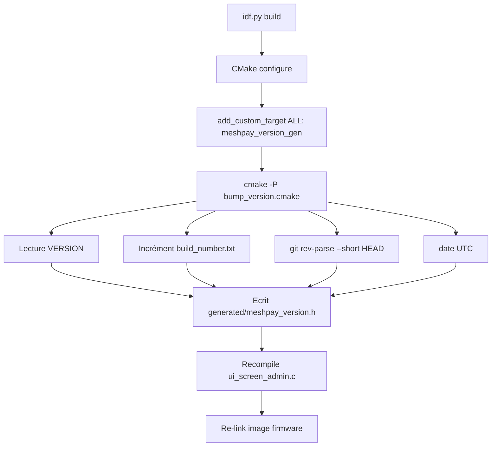

---
tags:
  - meshpay
  - meshpay
  - design
Projets:
  - Mesh Pay
Topics:
  - Documentation technique
  - Build system
  - UI
Date: 2026-05-15
---

# 15 — Versioning et numéro de build

> [!info] À quoi sert cette note
> Décrit le schéma de versioning du firmware MeshPay : version sémantique manuelle (`VERSION`), compteur de build local auto-incrémenté, capture du SHA git et de la date. Le tout est affiché en bas de l'écran admin du device pour le support et le diagnostic.

## 🎯 Objectif

Permettre à un opérateur, en regardant un device, de savoir **exactement quel firmware il a sous les yeux** :
- quelle version fonctionnelle (palier majeur/mineur/patch),
- quel build (chaque `idf.py build` produit un numéro distinct),
- quand il a été compilé,
- depuis quel commit (et si l'arbre était dirty).

## 🔧 Composantes

| Élément | Stockage | Mise à jour | Tracé git |
|---|---|---|---|
| Version sémantique `MAJEUR.MINEUR.PATCH` | `VERSION` (racine) | Manuelle (bump quand on change de palier) | ✅ |
| Compteur de build | `build_number.txt` (racine) | Auto-incrémenté à chaque `idf.py build` | ❌ (gitignored) |
| SHA git court | dérivé à la volée par CMake | Auto via `git rev-parse --short HEAD` | n/a |
| Marqueur `-dirty` | dérivé via `git status --porcelain` | Auto | n/a |
| Date du build | dérivée via `string(TIMESTAMP)` UTC | Auto | n/a |

Pourquoi le compteur est **local** (gitignored) : éviter qu'un `idf.py build` salisse le repo à chaque appel. Le numéro de build n'a de sens que sur la machine du dev qui flashe ses devices ; pour une trace partagée, le SHA git suffit.

## 🧩 Format affiché

```
v0.1.0 build 47 - 2026-05-15 abc1234
v0.1.0 build 48 - 2026-05-15 abc1234-dirty   ← repo modifié
v0.0.0 build 12 - 2026-05-15 nogit            ← build hors arbre versionné
```

## 📁 Fichiers concernés

- [`VERSION`](../../../../../Library/CloudStorage/Dropbox/Code/Mesh%20Pay/VERSION) — semver à éditer à la main
- [`build_number.txt`](../../../../../Library/CloudStorage/Dropbox/Code/Mesh%20Pay/build_number.txt) — compteur local (gitignored)
- [`tools/cmake/bump_version.cmake`](../../../../../Library/CloudStorage/Dropbox/Code/Mesh%20Pay/tools/cmake/bump_version.cmake) — script générateur autonome (`cmake -P …`)
- [`components/ui/CMakeLists.txt`](../../../../../Library/CloudStorage/Dropbox/Code/Mesh%20Pay/components/ui/CMakeLists.txt) — invoque le script via `add_custom_target(meshpay_version_gen ALL)`
- [`components/ui/src/ui_screen_admin.c`](../../../../../Library/CloudStorage/Dropbox/Code/Mesh%20Pay/components/ui/src/ui_screen_admin.c) — affiche `MESHPAY_VERSION_STRING` en footer
- Header généré : `build/.../meshpay_version.h` (sous le build dir du composant `ui`)

## ⚙️ Comment ça s'enchaîne au build



Le `ALL` sans `OUTPUT` déclaré force CMake à considérer la cible comme **toujours out-of-date** : elle se rejoue à chaque `idf.py build`, même quand aucun code n'a changé. C'est ce qu'on veut — sinon le compteur ne s'incrémenterait jamais.

## ✍️ Workflow

### Bump du palier fonctionnel (manuel)
1. Éditer `VERSION` (ex: `0.1.0` → `0.2.0`).
2. Commit.
3. Le prochain `idf.py build` capturera la nouvelle valeur.

### Build courant (automatique)
- Lancer `idf.py build`. Le numéro de build s'incrémente, le binaire embarque la chaîne fraîche.

### Reset du compteur local
- Supprimer ou remettre `0` dans `build_number.txt`. Le prochain build repart à `1`.

## 🔍 Cas limites gérés

- **Pas de git** (zip décompressé) : SHA = `nogit`, build continue.
- **Compteur corrompu** (texte non numérique) : reset à `0` + warning CMake.
- **Build hors du worktree** : `MESHPAY_ROOT` est résolu via `CMAKE_CURRENT_LIST_DIR` du composant `ui`, donc fonctionne aussi bien pour le firmware principal que pour `test_app/`.

## 🎨 Affichage UI

Le footer apparaît **uniquement sur l'écran admin** (utilisateur final non concerné). Style :
- police normale (Montserrat 14)
- opacité 60 % (gris discret)
- ancrée `LV_ALIGN_BOTTOM_MID`
- `FOOTER_H = 18 px` réservés en bas de l'écran (la grille de boutons est réduite d'autant pour ne pas chevaucher)

## 🔗 Notes liées

- [[Misterniark/Projet/Mesh Pay/Doctech V2/Ancienne note technique/02 - Architecture générale]]
- [[Misterniark/Projet/Mesh Pay/Doctech V2/Ancienne note technique/05 - Décisions UI]]
- [[Misterniark/Projet/Mesh Pay/Doctech V2/Ancienne note technique/08 - Journal des corrections récentes]]
